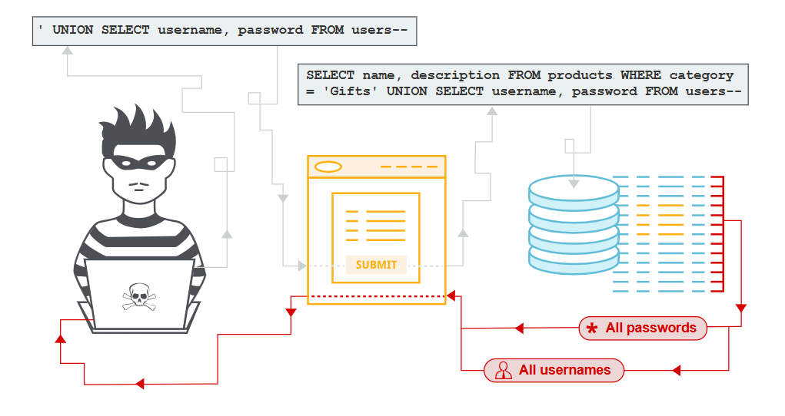

# SQL Injection

## Ru Что это?

SQL-инъекция (SQLi) — это уязвимость веб-безопасности, позволяющая злоумышленнику вмешиваться в запросы, которые приложение отправляет к своей базе данных. Это может позволить злоумышленнику получить доступ к данным, которые он обычно не может получить. Это могут быть данные, принадлежащие другим пользователям, или любые другие данные, к которым приложение имеет доступ.

## En What is SQL Injection?

SQL Injection (SQLi) is a web security vulnerability that allows an attacker to interfere with the queries that an application sends to its database. This can allow an attacker to gain access to data that they normally cannot access. This can be data belonging to other users, or any other data that the application has access to.

