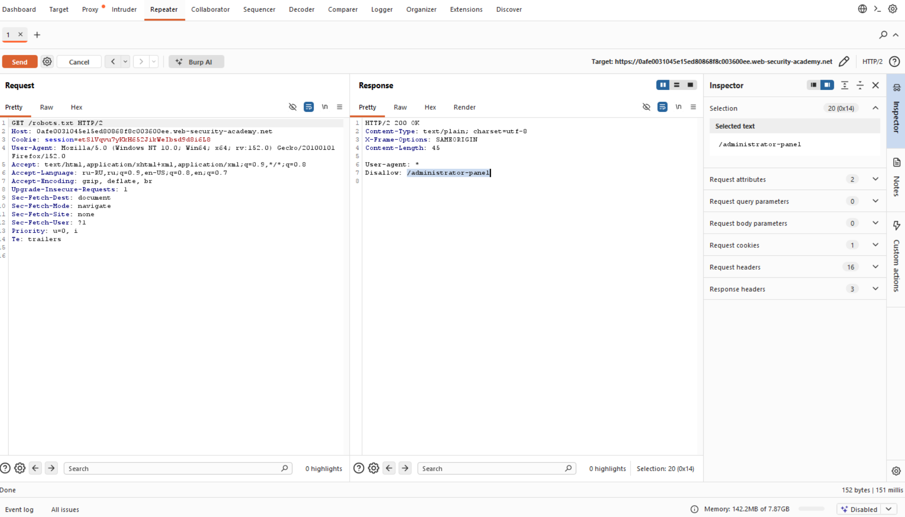
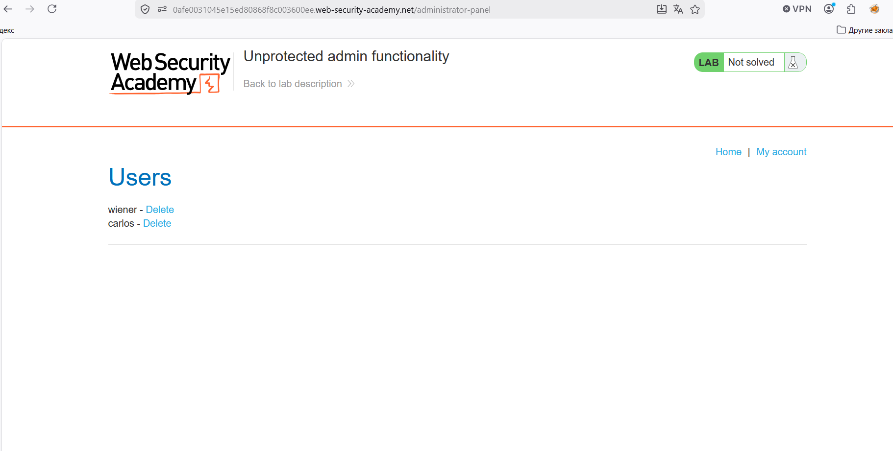
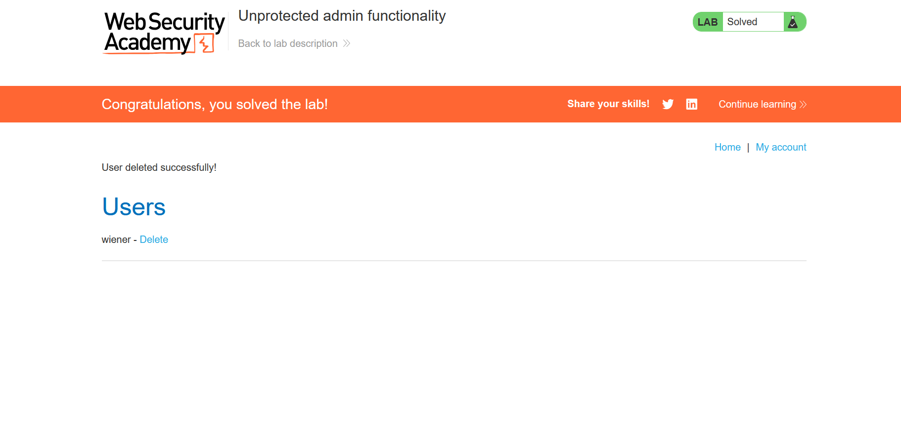

# Лаборатория: Незащищенные административные функции

В этой лаборатории используется незащищенная панель администратора.

Решите лабораторную работу, удалив пользователя carlos.

Ход работы:

Делаем проверку url-подмены домена 2-ого уровня:

Проверяем `admin`, `administrator` и `robots.txt`:

Видим Disallow: /administrator-panel, пробуем проверить:

Удаляем пользователя:

Успех!
