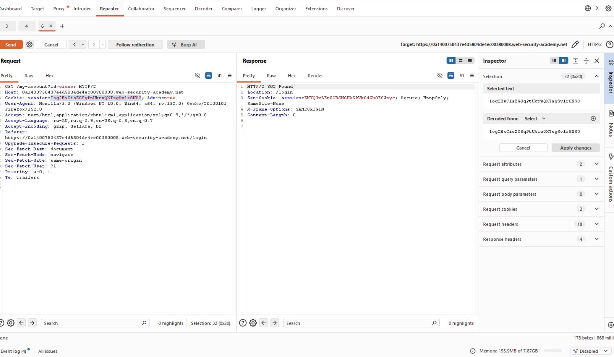
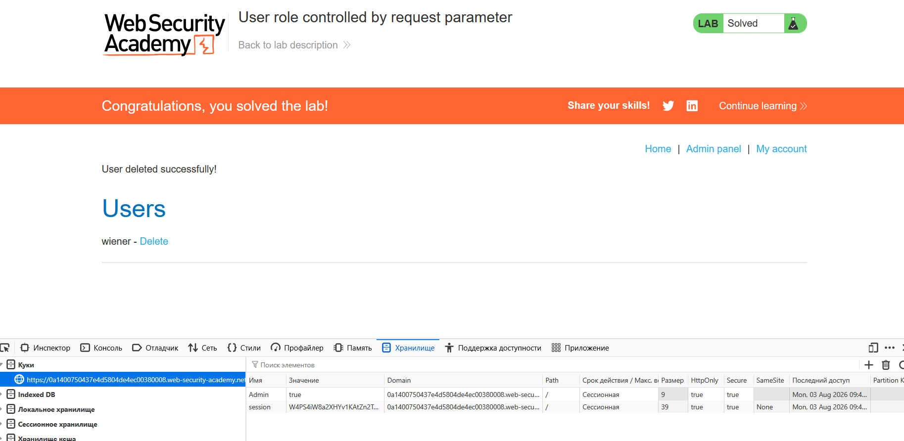

# Лабораторная работа: Роль пользователя определяется параметром запроса.

В этой лаборатории есть панель администратора `/admin`, которая идентифицирует администраторов с помощью поддельного cookie-файла.

Решите лабораторную работу, войдя в панель администратора и используя её для удаления пользователя `carlos`.

Вы можете войти в свою учетную запись, используя следующие учетные данные `:wiener:peter`.

Ход работы:

Необходимо исследовать страницу входа:

Мы нашли флаг администратора `False` меняем на `True` и смотрим на поведение, видим что ошибки не происходит, далее меняем куку на странице входа и меняем флаг на `True`.

После чего смотрим на результат:

Успех!
