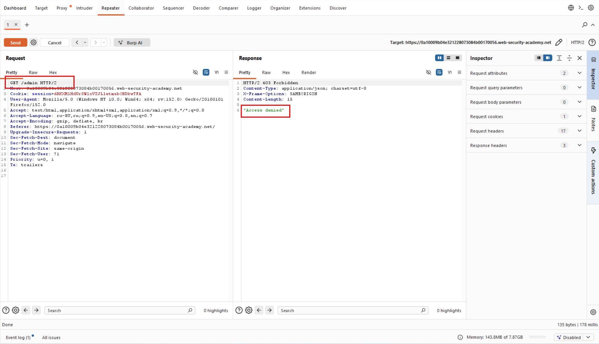
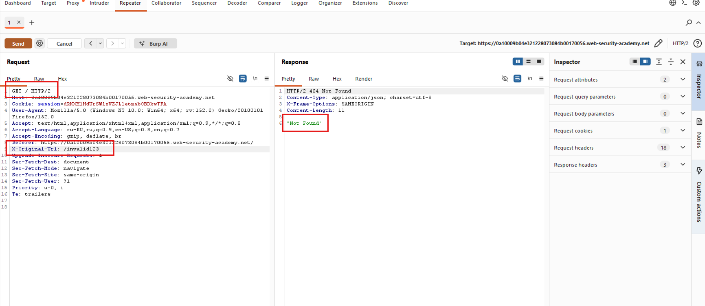
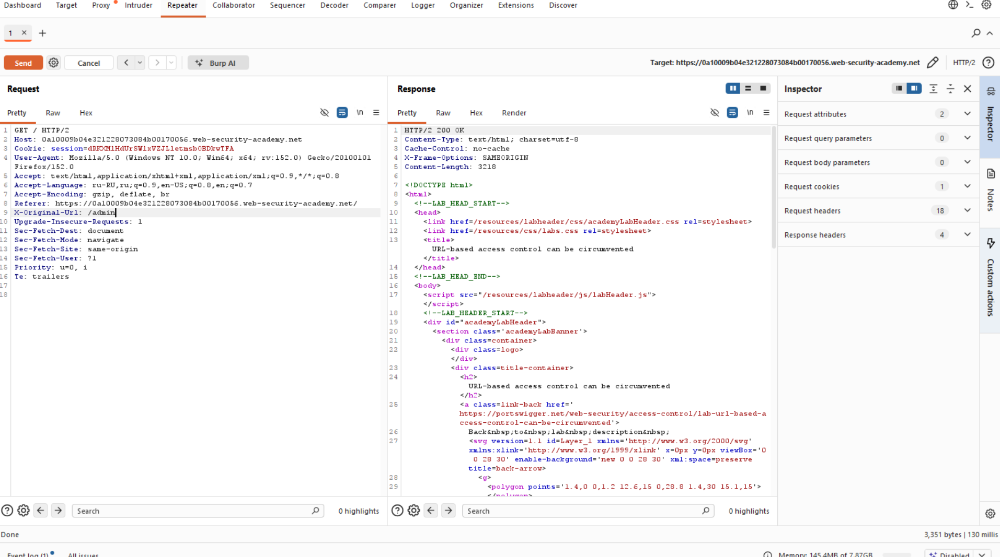
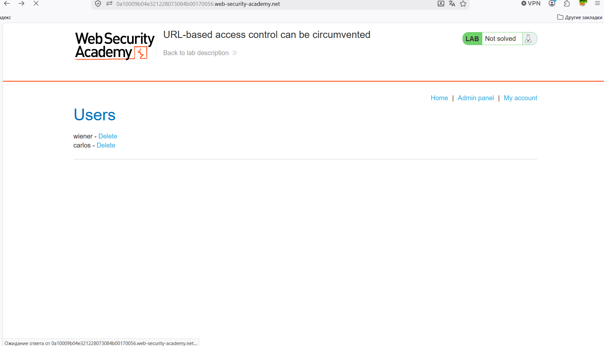

# Лабораторная работа: Контроль доступа на основе URL-адресов можно обойти.

На этом сайте есть неавторизованная панель администратора по адресу `/admin`, но в настройках внешнего доступа к этому пути установлена ​​блокировка. Однако бэкэнд-приложение построено на фреймворке, поддерживающем заголовок `X-Original-URL`.

Для решения лабораторной работы войдите в панель администратора и удалите пользователя `carlos`.

Ход работы:

Начинаем анализировать поведение приложения:

Откуда мы понимаем, что у нас существует `admin`,  но доступа нет...

Попытаемся определить работает ли заголовок `X-Original-URL`, который является нестандартным заголовком, при помощи него в backend-приложения сообщается какой URL был запрошен клиентом до того, как reverse proxy переписал маршрут.

Заголовок сработал, так как в ответе мы увидели сообщение, что URL не найден, так как мы прописали запрос на несуществующий домен...

Далее делаем запрос на адрес `/admin`:

И удаляем пользователя:

Успех!
