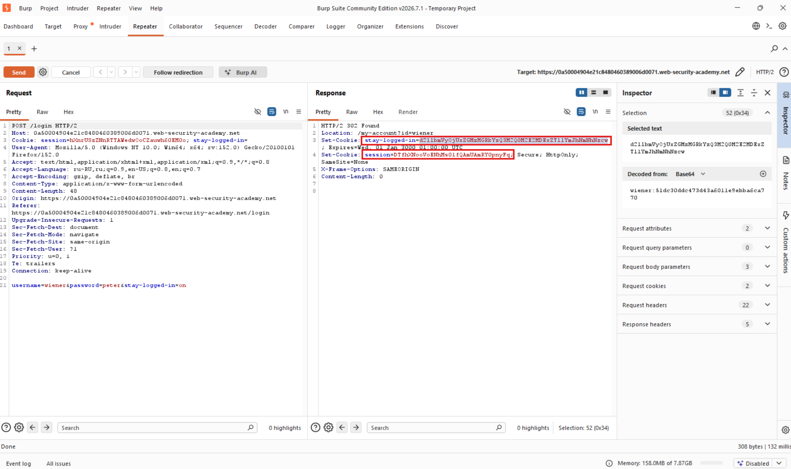

# Лабораторная работа: Взлом паролей в автономном режиме

В этой лабораторной работе хэш пароля пользователя хранится в `cookie-файле`. Также в работе обнаружена `XSS-уязвимость` в функции комментирования. Для решения задачи получите `stay-logged-incookie-файл` Карлоса и используйте его для взлома его пароля. Затем войдите в систему под его именем carlosи удалите его учетную запись со страницы `Моя учетная запись`.

Ваши учетные данные: `wiener:peter`
Имя пользователя жертвы: `carlos`

Ход работы:

Начинаем анализировать:

Видим, что обработка данных происходит таким образом, что хранится кука сессии и аналогично создается кука для запоминания пользователя.

