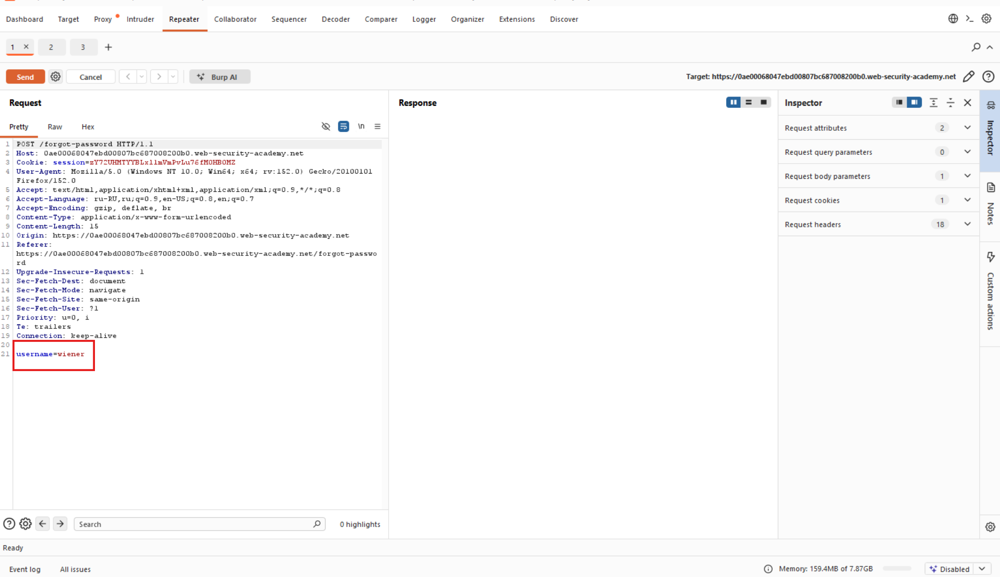
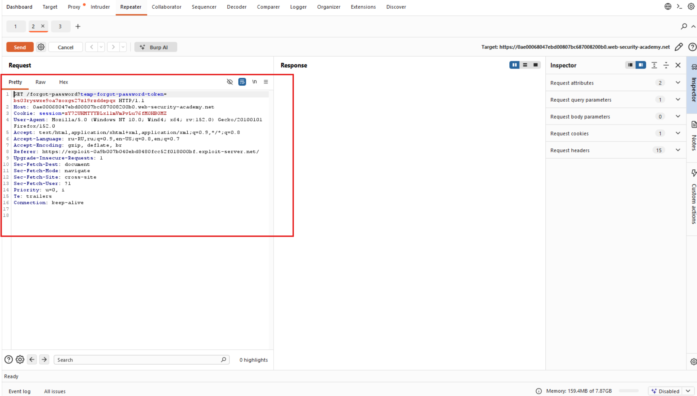
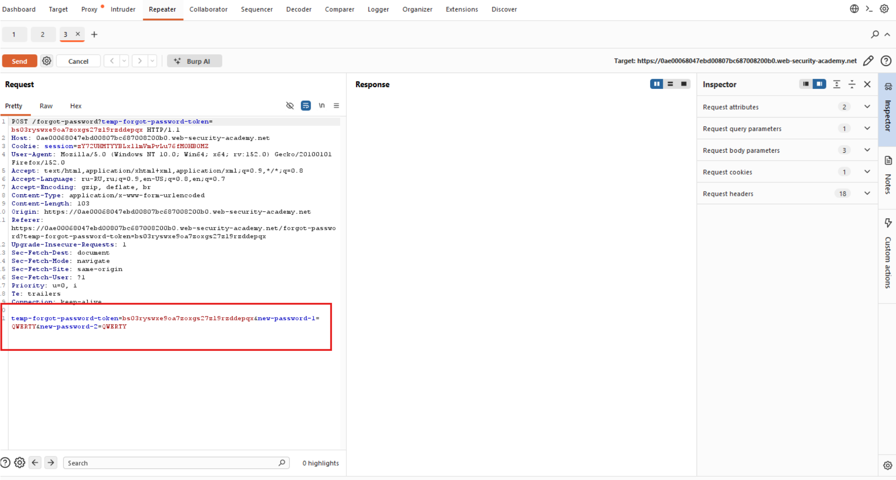
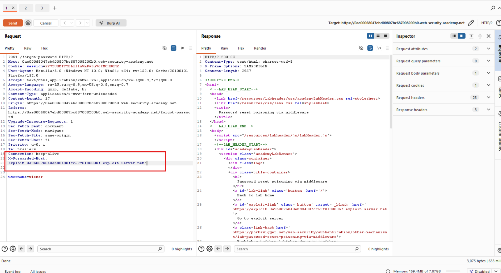
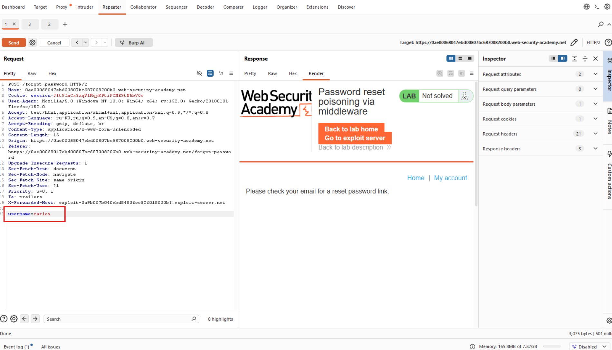
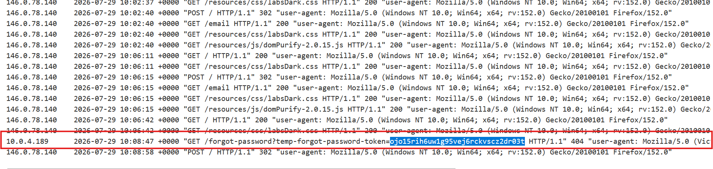
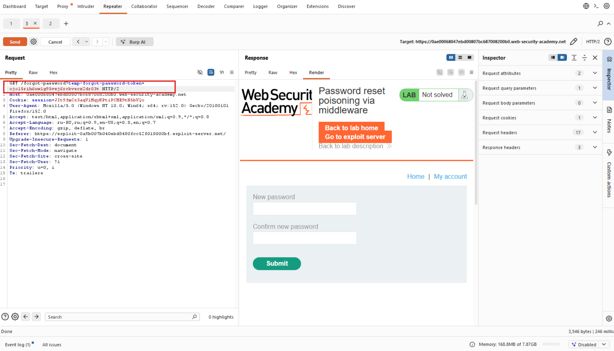
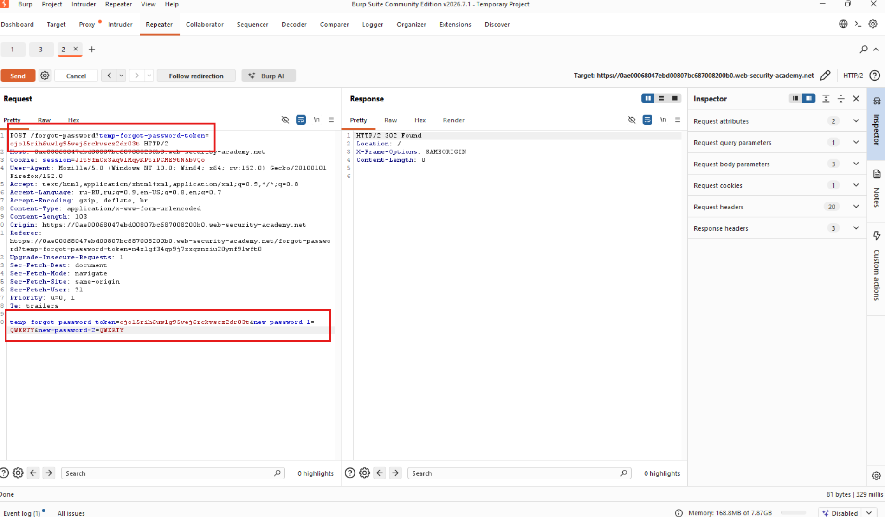
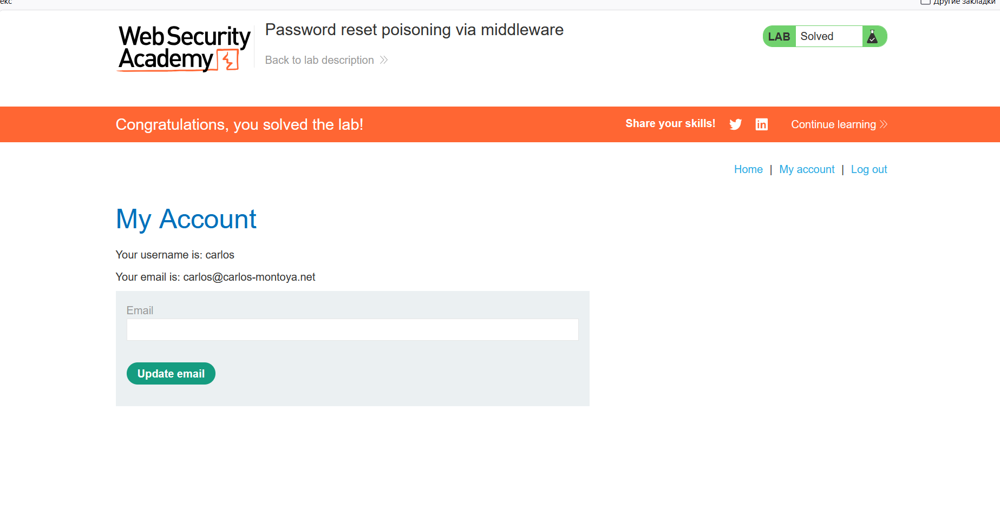

# Лабораторная работа: Отравление системы сброса пароля с помощью промежуточного программного обеспечения.

Эта лабораторная работа уязвима для атаки типа «отравление сброса пароля». Пользователь `carlos` будет неосторожно переходить по ссылкам в полученных электронных письмах. Для решения задачи войдите в учетную запись Карлоса. Вы можете войти в свою учетную запись, используя следующие учетные данные: `wiener:peter`. Любые электронные письма, отправленные на эту учетную запись, могут быть прочитаны через почтовый клиент на сервере эксплойта.

Ход работы:

Начинаем анализировать:

Первое что мы начнем делать, это посмотрим, что происходит в момент, когда пытаемся сбросить пароль, вводим имя для почты:

Второй шаг, просмотр того, что происходит, когда перешли по ссылке с почты на восстановление пароля:

На третьем шаге смотрю, что происходит, в момент, когда мы сменили пароль:

Далее пытаемся внедрить заголовок X-Forwarded-Host, при помощи которого можно обойти аутентификацию:

Знак хороший, то есть заголовок поддерживается.

Далее необходимо поменять `username=carlos`, это нужно для того, чтобы пришла ссылка на почту `carlos` для сброса пароля.

Смотрим в логах:

Попался, берем куку и начинаем обход:

И следующим шагом подменяем:

Проверяем пароль для пользователя `carlos`:

Успех!
