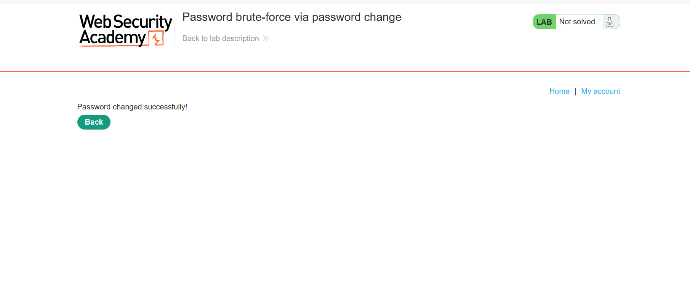
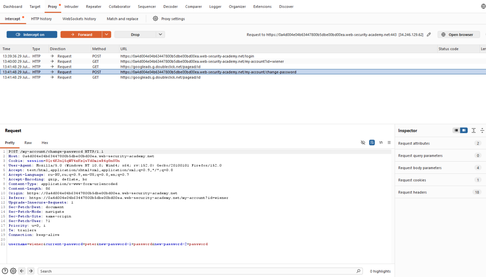
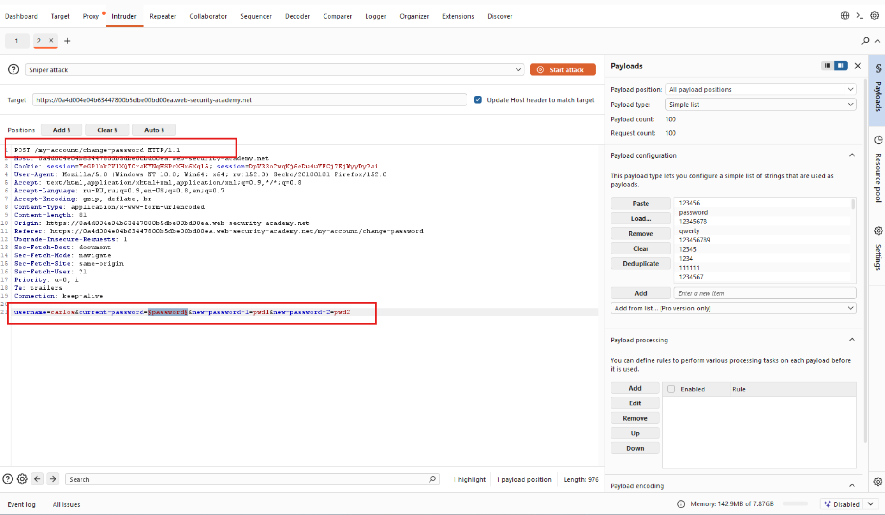
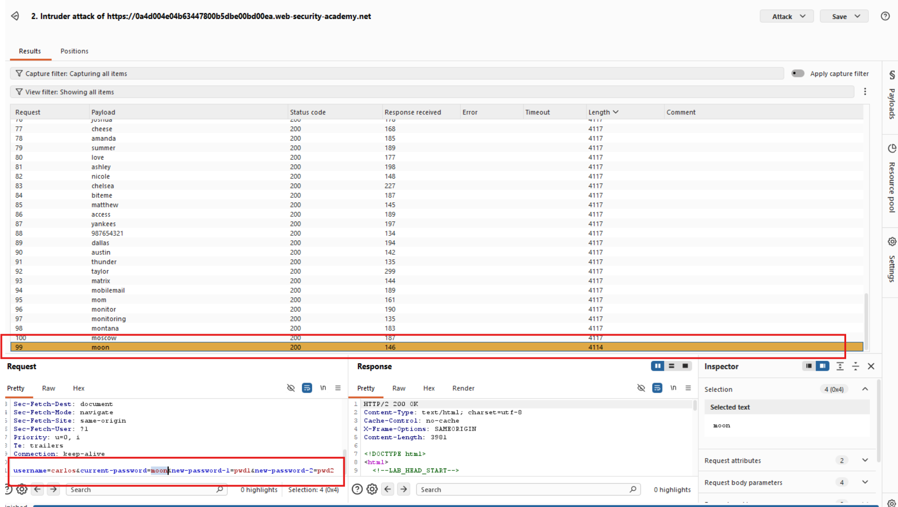
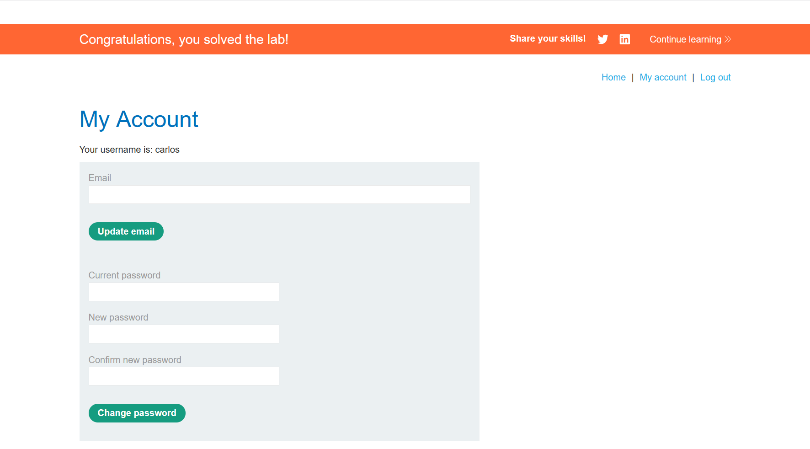

# Лабораторная работа: Взлом пароля методом перебора с последующей сменой пароля.

Функция смены пароля в этой лабораторной работе делает её уязвимой для атак методом перебора. Чтобы решить эту лабораторную работу, используйте список возможных паролей для перебора пароля учетной записи Карлоса и получите доступ к его странице «Моя учетная запись».

Ваши учетные данные: `wiener:peter`

Имя пользователя жертвы: `carlos`

[Пароли кандидатов](https://portswigger.net/web-security/authentication/auth-lab-passwords)

Ход работы:

Начинаем анализировать:

Первое что сделаю, попытаюсь изменить пароль:

Попытка успешна!

Далее попытаюсь изменить с неправильным паролем...
Перенаправит на страницу входа.

После попытки ввода верного пароля, скажет что пароль неверный, так как на предыдущем шаге был задан неверный пароль, странное поведение...
Также стоит блок на 1 минуту... Для брутфорса необходимо обойти блокировку.

После анализа выяснилось:
1. Новые пароли не совпадают, а старый был введен некорректно -> Получаем ошибку, текущий пароль был введен некорректно.
2. Новые пароли не совпадают, а старый был введен корректно -> Выводится сообщение об некорректных попытках ввода пароля.
3. Новые пароли совпадают, а старый был введен не корректно -> Перенаправляет на страницу ввода и блокирует учетную запись на минуту.

Начинаем брутфорс:

Смотрим результат:

Пытаемся авторизоваться:

Успех!
