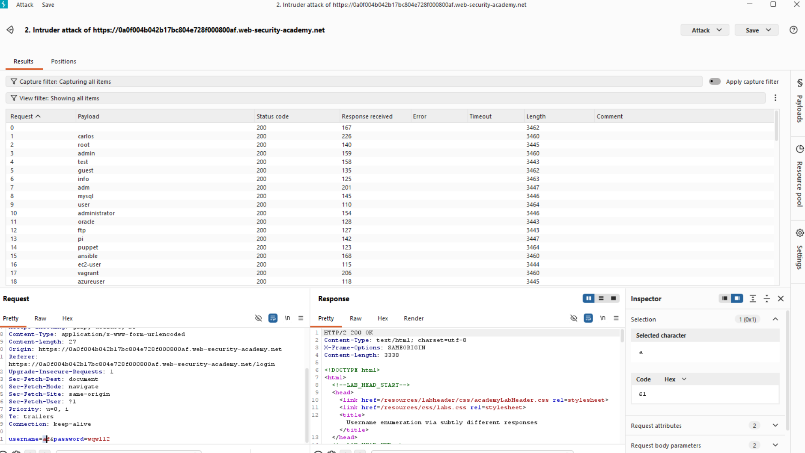

# Лабораторная работа: Перечисление имен пользователей на основе незначительно отличающихся ответов.

Эта лаборатория уязвима для атак методом перебора имен пользователей и паролей. В ней используется учетная запись с предсказуемым именем пользователя и паролем, которые можно найти в следующих списках слов:

[Имена пользователей кандидатов](https://portswigger.net/web-security/authentication/auth-lab-usernames)

[Пароли кандидатов](https://portswigger.net/web-security/authentication/auth-lab-passwords)

Для решения лабораторной работы необходимо определить допустимое имя пользователя, подобрать пароль этого пользователя методом перебора, а затем получить доступ к странице его учетной записи.

Ход работы:

Поробуем методом брутфорса определить пользователя:

Это нам особо ничего не дало, попробуем проявить смекалку, проанализируем ответ Invalid username or password.
