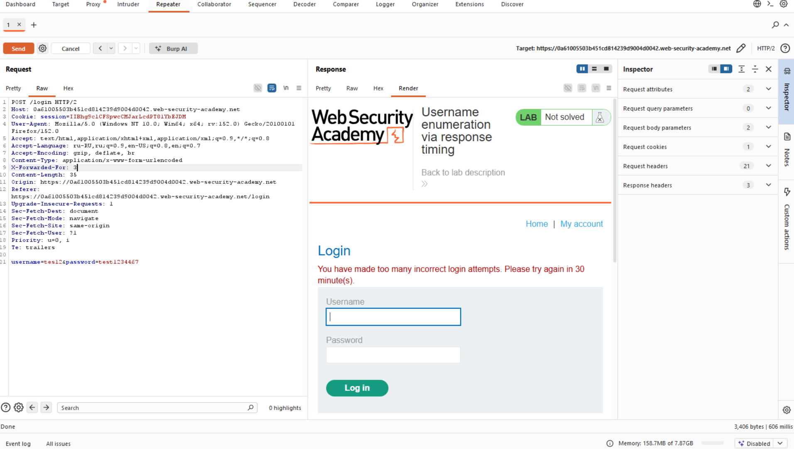

# Лабораторная работа: Перечисление имен пользователей на основе времени ответа.

В этой лабораторной работе уязвимость заключается в переборе имен пользователей с использованием времени отклика. Для решения задачи необходимо перебрать допустимое имя пользователя, подобрать пароль этого пользователя методом перебора, а затем получить доступ к странице его учетной записи.

Ваши учетные данные: `wiener:peter`

[Имена пользователей кандидатов](https://portswigger.net/web-security/authentication/auth-lab-usernames)

[Пароли кандидатов](https://portswigger.net/web-security/authentication/auth-lab-passwords)

Ход работы:

Начинаем анализировать ответы:
При попытке авторизации больше 2-ух раз, блокируется IP-адрес, стоит блокировка, для начала необходимо обойти её, для дальнейшей работы.
Заголовок `X-Forwarded-For: 3` стандарт для обхода идентификации IP-адреса.

Дальше начинаем анализировать время обработки запроса проверки пароля и имени пользователя, понимаем, что при увеличении длины пароля, время проверки в backend-логике увеличивается... 
