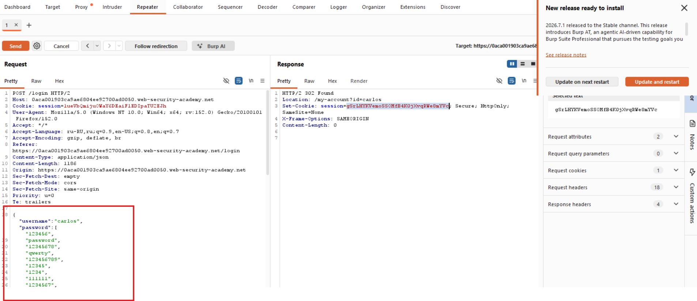
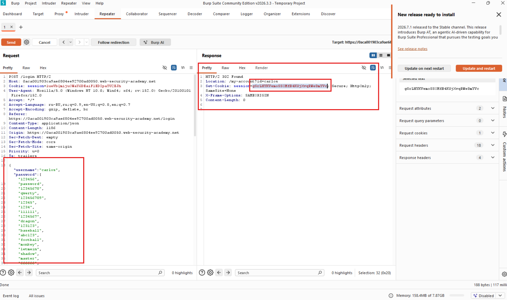
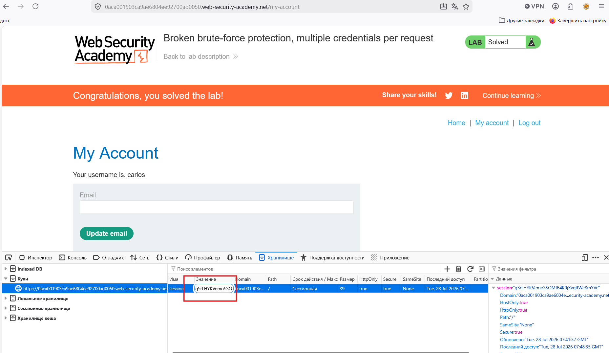

# Лабораторная работа: Не работает защита от атак методом перебора, несколько учетных данных на один запрос.

Эта лаборатория уязвима из-за логической ошибки в системе защиты от перебора паролей. Чтобы решить задачу, переберите пароль Карлоса, а затем получите доступ к его странице учетной записи.

Имя пользователя жертвы: `carlos`

[Пароли кандидатов](https://portswigger.net/web-security/authentication/auth-lab-passwords)

Ход работы:

Для начал посмотрим в каком формате передаются данные для авторизации:

Видим формат JSON, пробуем посмотреть как приложение поведет себя, если мы подадим списком пароли.

Проверка проходит, ошибки не выдает, следовательно мы можем подавать пароли списком:

Видим 302 ошибку, следовательно какой-то из паролей подходит, но также мы можем взять куку уже для авторизированного пользователя и попытаться подменить:

Подменили и видим, что мы вошли в систему!

