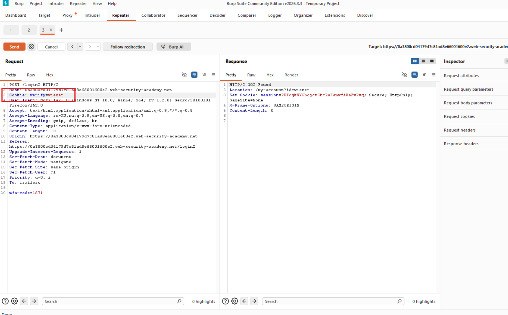
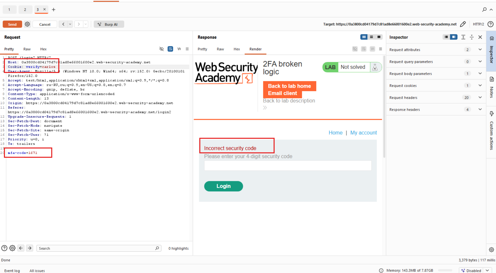

# Лабораторная работа: логика неработоспособности двухфакторной аутентификации

Двухфакторная аутентификация в этой лабораторной работе уязвима из-за ошибочной логики. Чтобы решить задачу, перейдите на страницу учетной записи Карлоса.

Ваши учетные данные: `wiener:peter`
Имя пользователя жертвы: `carlos`
Вы также можете получить доступ к почтовому серверу для получения кода подтверждения двухфакторной аутентификации.

Ход работы:

Начинаем анализировать:
Первой уязвимостью является то, что в 2FA у нас реализована логика где `Cookie: session=qkS17Rl9I6n2tXyWKxHJYX4sNAR9yeai;` а за ним идёт: `verify=wiener`, что является потенциально опасным, если поменяем пользователя и получим каким-то образом код-пароль...

Попробую убрать сессию токена в POST-запросе и посмотрю что будет:

Вижу, что токен не влияет на поведение входа... Делаю предположение, что важным является MFA код.

Делаю подмену пользователя:

Видим ошибку, так как MFA-код был для другого пользователя...

Далее нужно просто подобрать MFA-код брутфорсом и посмотреть код 302 скопировать куку и вставить куку на странице ввода кода...

Так как BruteForce требует 10000 запросов, а в бесплатной версии BurpSuite это будет очень долго исполняться, то выполнить данное задание не получится...
