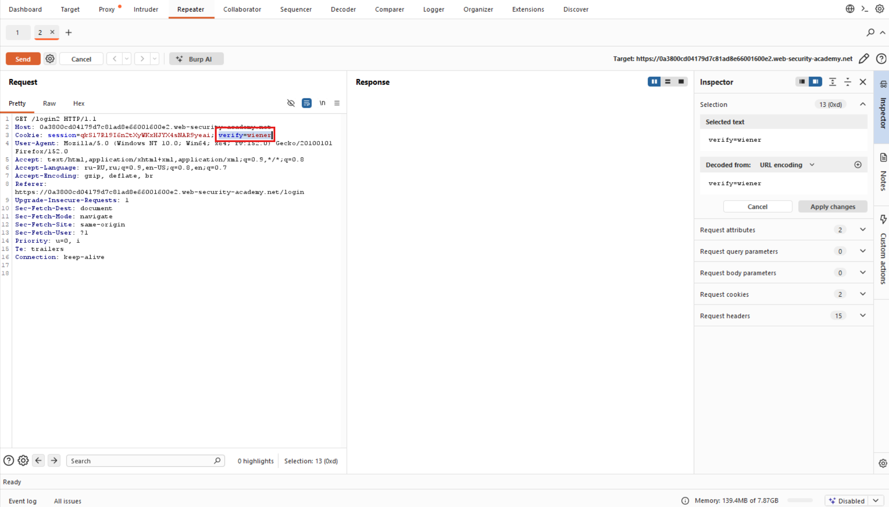

# Лабораторная работа: логика неработоспособности двухфакторной аутентификации

Двухфакторная аутентификация в этой лабораторной работе уязвима из-за ошибочной логики. Чтобы решить задачу, перейдите на страницу учетной записи Карлоса.

Ваши учетные данные: `wiener:peter`
Имя пользователя жертвы: `carlos`
Вы также можете получить доступ к почтовому серверу для получения кода подтверждения двухфакторной аутентификации.

Ход работы:

Начинаем анализировать:
Первой уязвимостью является то, что в 2FA у нас реализована логика где `Cookie: session=qkS17Rl9I6n2tXyWKxHJYX4sNAR9yeai;` а за ним идёт: `verify=wiener`, что является потенциально опасным, если поменяем пользователя и получим каким-то образом код-пароль...

