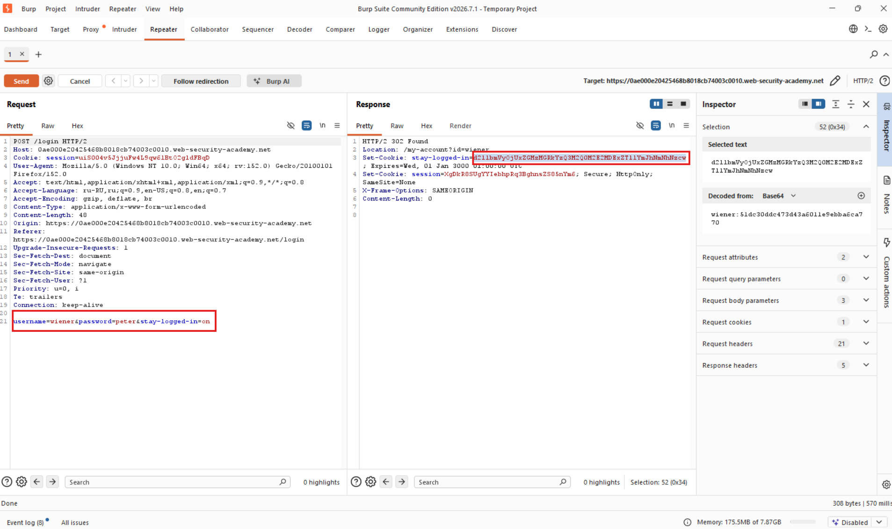
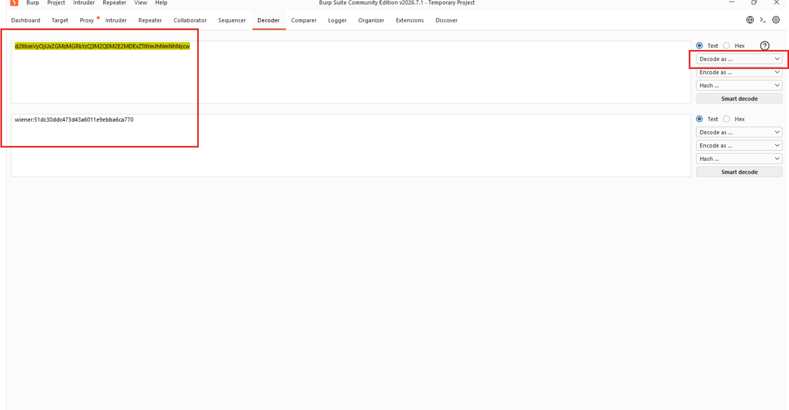
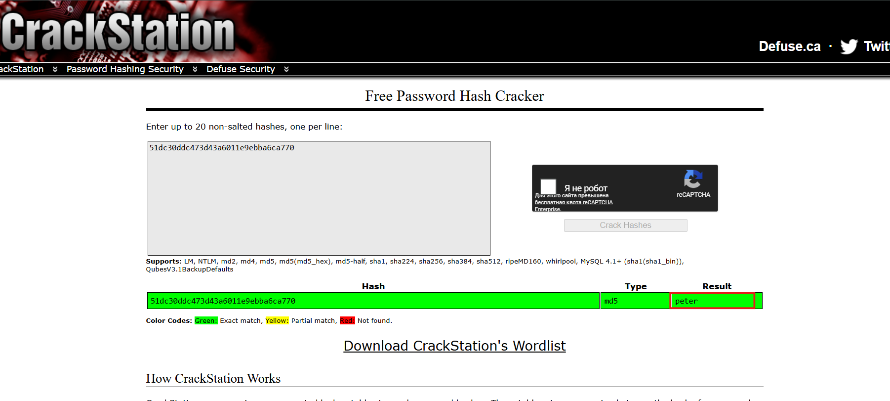
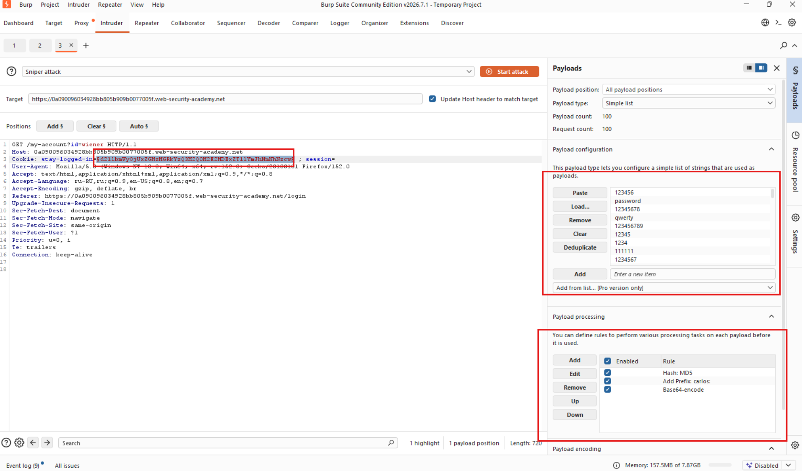

# Лабораторная работа: Взлом методом перебора cookie-файла, гарантирующего сохранение авторизации.

Эта лабораторная работа позволяет пользователям оставаться авторизованными даже после закрытия браузера. Файл cookie, используемый для обеспечения этой функциональности, уязвим для подбора методом перебора паролей.

Чтобы решить задачу, нужно методом перебора взломать cookie-файл Карлоса и получить доступ к его странице `Мой аккаунт` .

Ваши учетные данные: `wiener:peter`
Имя пользователя жертвы: `car`

Ход работы:

Начинаем анализировать, делаем запрос и смотрим что в ответе, получили подозрительную куку:

Попытаемся декодировать и посмотреть вдруг что-то увидим, декодируем при помощи Base64:

Видим: `wiener:51dc30ddc473d43a6011e9ebba6ca770` наш логин и возможно захеширован пароль, пытаюсь понять:

Верно, используется протокол MD5.

Далее необходимо произвести BruteForce:

с данными настройками, чтобы мы правильный формат куки перебирали.

BruteForce завершен, находим код 200.

Пытаемся авторизоваться.

Успех!

