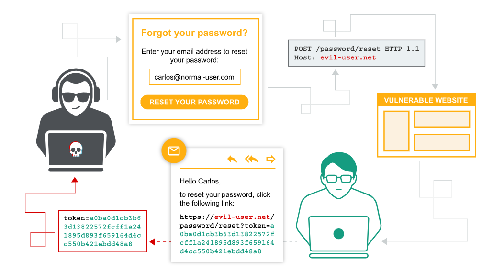

# Уязвимости аутентификации

Концептуально уязвимости аутентификации легко понять. Однако они, как правило, имеют критически важное значение из-за очевидной взаимосвязи между аутентификацией и безопасностью.

Уязвимости аутентификации могут позволить злоумышленникам получить доступ к конфиденциальным данным и функциям. Они также открывают дополнительную поверхность для дальнейших атак. Поэтому важно научиться выявлять и использовать уязвимости аутентификации, а также обходить распространенные меры защиты.

В этом разделе мы поясним:

- Наиболее распространенные механизмы аутентификации, используемые веб-сайтами.
- Потенциальные уязвимости в этих механизмах.
- Встроенные уязвимости в различных механизмах аутентификации.
- Типичные уязвимости, возникающие из-за неправильной реализации.
- Как сделать собственные механизмы аутентификации максимально надежными.

# Что такое аутентификация?

Аутентификация — это процесс проверки личности пользователя или клиента. Веб-сайты потенциально доступны любому, кто подключен к интернету. Это делает надежные механизмы аутентификации неотъемлемой частью эффективной веб-безопасности.4

Существует три основных типа аутентификации:

Что-то, что вам известно , например, пароль или ответ на контрольный вопрос. Иногда это называют «факторами знания».
Что-то, что у вас есть . Это физический объект, например, мобильный телефон или защитный токен. Иногда их называют «факторами владения».
То, чем вы являетесь или что делаете. Например, ваши биометрические данные или модели поведения. Иногда их называют «факторами наследственности».
Механизмы аутентификации используют целый ряд технологий для проверки одного или нескольких из этих факторов.

# В чём разница между аутентификацией и авторизацией?

Аутентификация — это процесс проверки того, что пользователь действительно тот, за кого себя выдает. Авторизация включает в себя проверку того, разрешено ли пользователю совершать те или иные действия.

# Как возникают уязвимости аутентификации?

Большинство уязвимостей в механизмах аутентификации возникают одним из двух способов:

- Механизмы аутентификации слабы, поскольку не обеспечивают адекватной защиты от атак методом перебора паролей.
- Логические ошибки или некачественный код в реализации позволяют злоумышленнику полностью обойти механизмы аутентификации. Иногда это называют «нарушенной аутентификацией».

Во многих областях веб-разработки логические ошибки приводят к непредсказуемому поведению веб-сайта, что может представлять собой проблему безопасности, а может и нет. Однако, поскольку аутентификация имеет решающее значение для безопасности, весьма вероятно, что ошибочная логика аутентификации подвергает веб-сайт проблемам безопасности.

# Каковы последствия уязвимой аутентификации?

Последствия уязвимостей аутентификации могут быть серьезными. Если злоумышленник обходит аутентификацию или взламывает учетную запись другого пользователя методом перебора паролей, он получает доступ ко всем данным и функциям скомпрометированной учетной записи. Если ему удается взломать учетную запись с высокими привилегиями, например, системного администратора, он может получить полный контроль над всем приложением и потенциально получить доступ к внутренней инфраструктуре.

Даже взлом учетной записи с низкими привилегиями может предоставить злоумышленнику доступ к данным, к которым он не должен иметь доступа, например, к конфиденциальной деловой информации. Даже если учетная запись не имеет доступа к каким-либо конфиденциальным данным, она все равно может позволить злоумышленнику получить доступ к дополнительным страницам, что создает дополнительную поверхность для атаки. Часто атаки высокой степени серьезности невозможны с общедоступных страниц, но они могут быть возможны с внутренних страниц.

## 1. Уязвимости в системе авторизации по паролю

