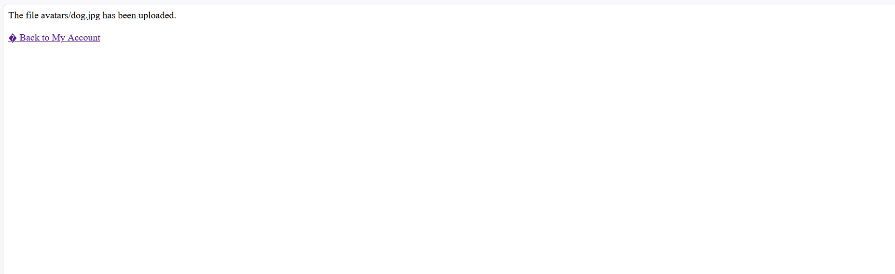
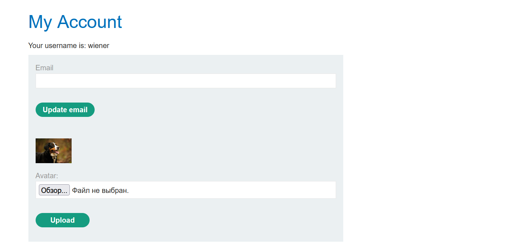
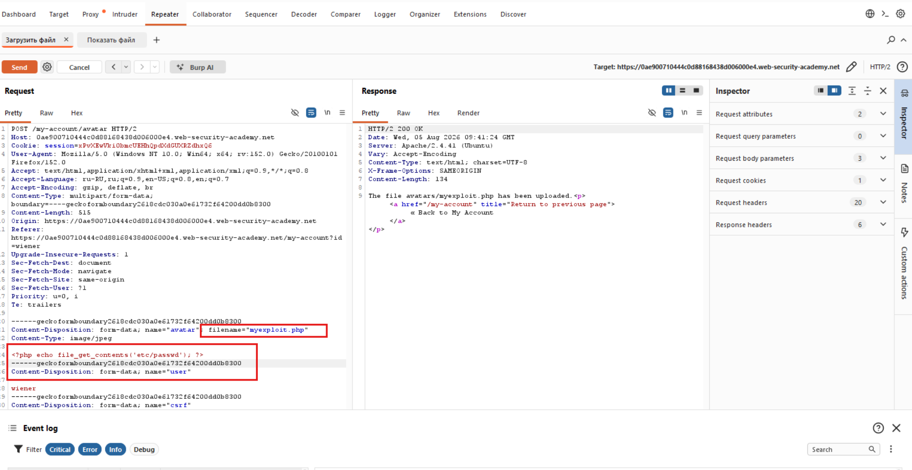
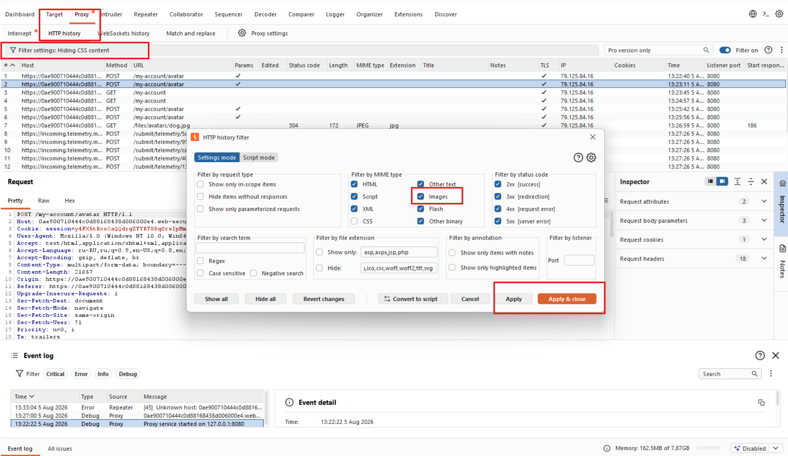
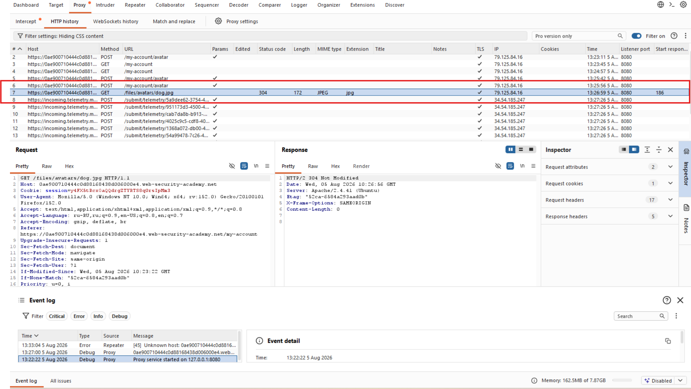
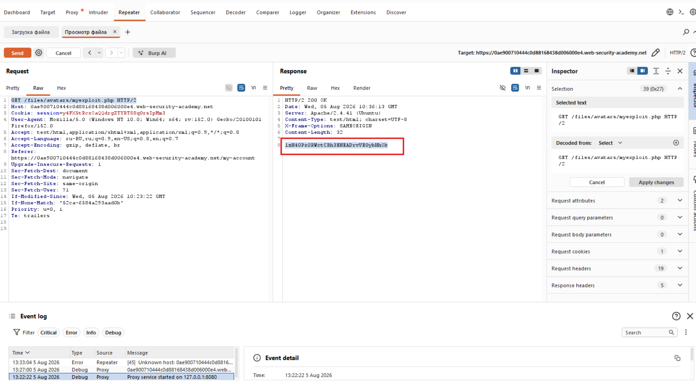
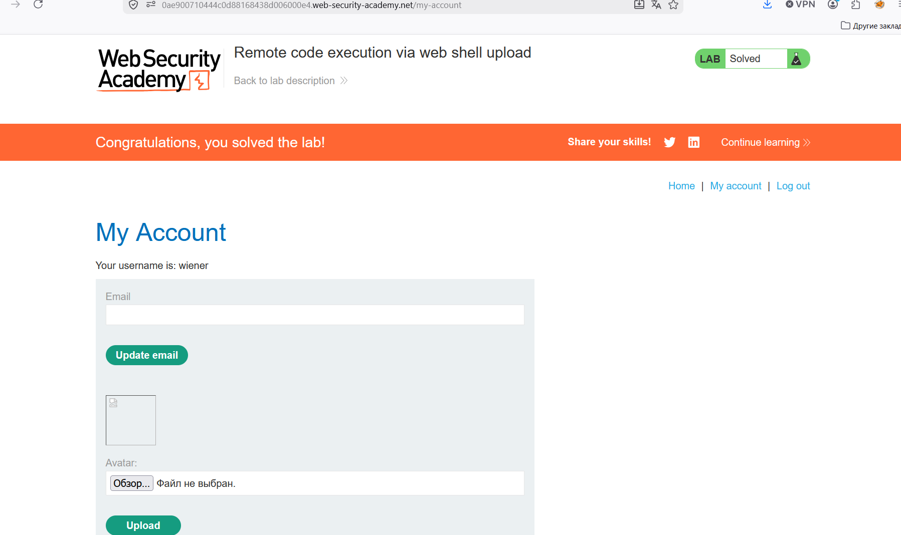

# Лабораторная работа: Удаленное выполнение кода посредством загрузки веб-оболочки.

В этой лабораторной работе используется уязвимая функция загрузки изображений. Она не выполняет никакой проверки загружаемых пользователями файлов перед их сохранением в файловой системе сервера.

Для решения лабораторной работы загрузите простую `PHP-оболочку` и используйте её для извлечения содержимого файла `/home/carlos/secret`. Отправьте этот секрет, используя кнопку, расположенную на баннере лабораторной работы.

Вы можете войти в свою учетную запись, используя следующие учетные данные: `wiener:peter`

Ход работы:

Загружаем аватарку на странице:

Далее смотрим что из себя представляют изображения, начинаем анализировать, что будет если изменить имя файла и сделать его исполняемым php-файлом:

Ошибок не произошло, следовательно можно сделать вывод, что методы защиты отсутствуют...

Далее необходимо получить доступ к GET запросу на получение изображения:

Находим и отправляем в Repeater

В POST-запросе мы меняем содержимое изображения на исполняемый файл: `filename="myexploit.php"` с инструкцией: `<?php echo file_get_contents('/home/carlos/secret'); ?>`, которая показывает секрет карлоса...

Далее в GET-запросе мы меняем 

`GET /files/avatars/dog.jpg HTTP/2` на `GET /files/avatars/myexploit.php HTTP/2` и отправляем на проверку:

И получаем секрет, после чего проверяем его:

Успех!
