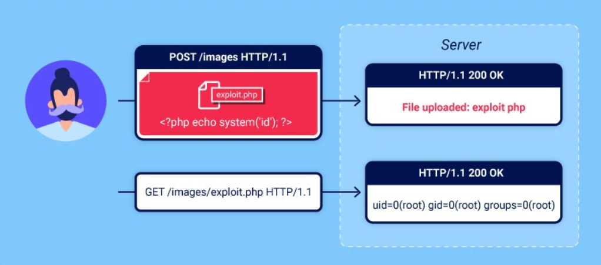

# File upload vulnerabilities (Уязвимости при загрузке файлов)

# Что такое уязвимости при загрузке файлов?

Уязвимости при загрузке файлов возникают, когда веб-сервер позволяет пользователям загружать файлы в свою файловую систему без надлежащей проверки таких параметров, как имя, тип, содержимое или размер. Ненадлежащее соблюдение ограничений может привести к тому, что даже простая функция загрузки изображений может использоваться для загрузки произвольных и потенциально опасных файлов. Это может включать даже серверные скриптовые файлы, позволяющие удаленное выполнение кода.

В некоторых случаях сам факт загрузки файла достаточен для нанесения ущерба. Другие атаки могут включать в себя последующий HTTP-запрос к файлу, как правило, для запуска его выполнения сервером.

# Каковы последствия уязвимостей при загрузке файлов?

Влияние уязвимостей при загрузке файлов, как правило, зависит от двух ключевых факторов:

Какой аспект файла веб-сайт не проверяет должным образом, будь то его размер, тип, содержимое и так далее.
Какие ограничения накладываются на файл после его успешной загрузки?
В худшем случае тип файла не проверяется должным образом, и конфигурация сервера позволяет выполнять определенные типы файлов (например, .phpи .jsp) как код. В этом случае злоумышленник потенциально может загрузить файл с серверным кодом, который функционирует как веб-оболочка, фактически предоставляя себе полный контроль над сервером.

Если имя файла не проверяется должным образом, это может позволить злоумышленнику перезаписать критически важные файлы, просто загрузив файл с тем же именем. Если сервер также уязвим для обхода каталогов, это может означать, что злоумышленники смогут загружать файлы даже в неожиданные места.

Несоблюдение требований к размеру файла, не соответствующих ожидаемым пороговым значениям, также может способствовать осуществлению атаки типа «отказ в обслуживании» (DoS), при которой злоумышленник заполняет доступное дисковое пространство.
