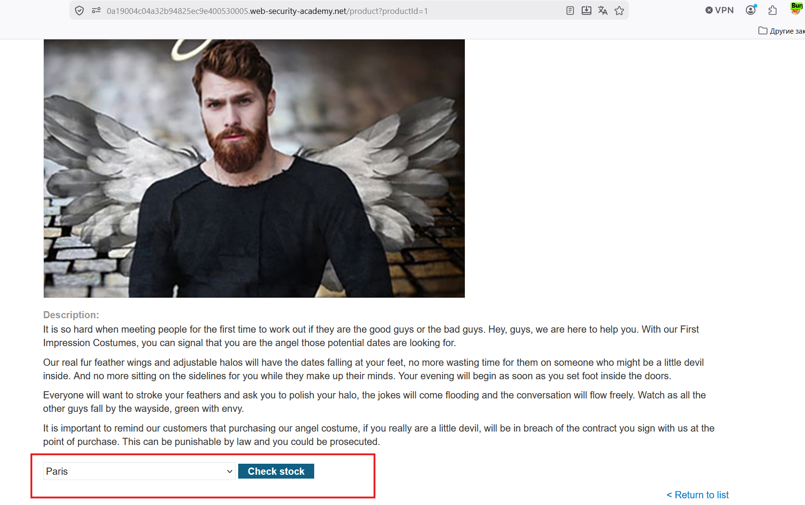
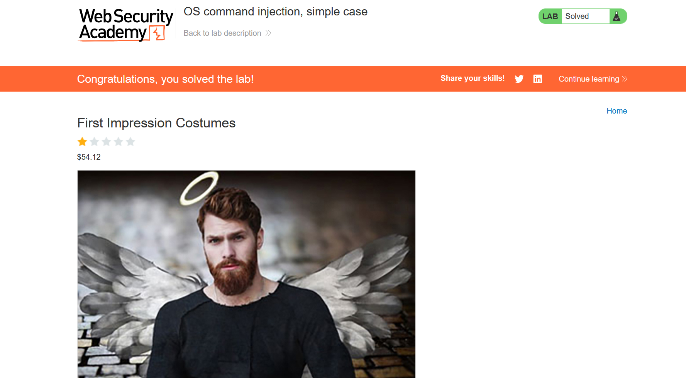
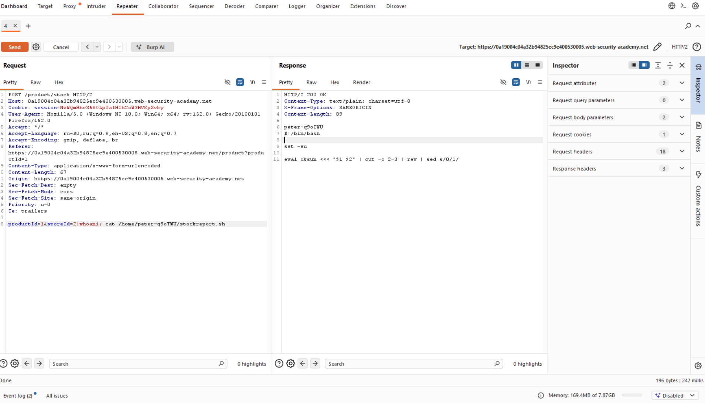

# Лабораторная работа: Внедрение команд операционной системы, простой пример.

В данной лабораторной работе обнаружена уязвимость внедрения команд операционной системы в программе проверки наличия товара на складе.

Приложение выполняет команду оболочки, содержащую предоставленные пользователем идентификаторы продукта и магазина, и возвращает в ответе необработанный вывод команды.

Для решения лабораторной работы выполните whoamiкоманду, чтобы определить имя текущего пользователя.

---

**Ход работы:**

Начинаем анализировать:

Для проверки товаров необходимо нажать:

После чего в Burp Suite мы видим POST-запрос:

Исследуем на предмет уязвимости:

`productId=1&storeId=2`

Для начала `productId=1 |whoami#&storeId=2` вижу ошибку 400, делаю `productId=1&storeId=2|whoami` 

Успех!

Пробую посмотреть чуть больше: 

`productId=1&storeId=2|whoami; cat /home/peter-q9oTWU/stockreport.sh` 

Вижу содержимое скрипта `stockreport.sh`:

