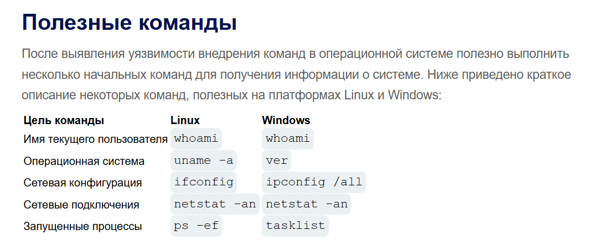

# OS command injection (Внедрение команд ОС)

**Что такое внедрение команд операционной системы??**

Внедрение команд операционной системы также известно как внедрение оболочки. Оно позволяет злоумышленнику выполнять команды операционной системы (ОС) на сервере, на котором работает приложение, и, как правило, полностью скомпрометировать приложение и его данные. Часто злоумышленник может использовать уязвимость внедрения команд ОС для компрометации других частей хостинговой инфраструктуры и использовать доверительные отношения для переноса атаки на другие системы внутри организации.

