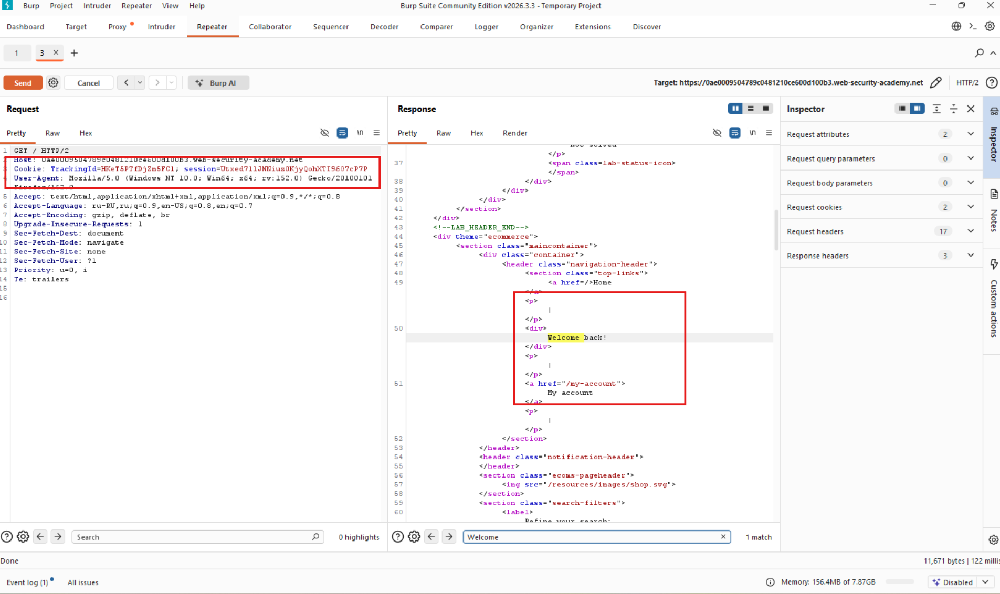

## Лабораторная работа: Слепая SQL-инъекция с условными ответами

В этой лабораторной работе обнаружена уязвимость слепой SQL-инъекции. Приложение использует отслеживающий cookie-файл для аналитики и выполняет SQL-запрос, содержащий значение отправленного cookie-файла.

Результаты SQL-запроса не возвращаются, и сообщения об ошибках не отображаются. Однако приложение отображает `Welcome back` сообщение на странице, если запрос возвращает какие-либо строки.

В базе данных есть другая таблица с названием `users`, со столбцами usernameи `password`. Вам необходимо использовать уязвимость слепой SQL-инъекции, чтобы узнать пароль пользователя `administrator`.

Для решения лабораторной работы войдите в систему под учетной записью `administrator` пользователя.

---

Vulnerability parametr - tracking cookie

Разобьём задачу на несколько подзадач:
1) Найти (подобрать) пароль администратора.
2) Войти в качестве администратора на сервер.

Аналитика: 
Если Cookie: TrackingId есть и session существует, то мы видим `Welcome Back!`

