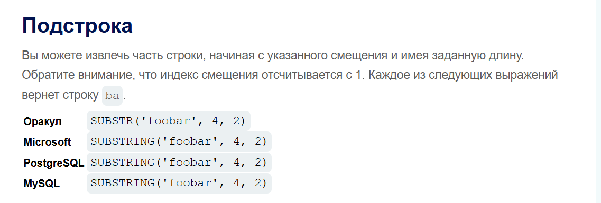

# Уязвимости слепой SQL-инъекции

## Что такое Blind SQL Injection?

**Blind SQL Injection** — это тип SQL-инъекции, при котором приложение **не отображает результаты SQL-запросов** и **не выводит сообщения об ошибках** базы данных.

Несмотря на отсутствие прямого вывода данных, уязвимость всё ещё может быть использована для получения информации. Вместо просмотра результата запроса атакующий анализирует поведение приложения и делает выводы на основе его ответов.

---

## Основные методы эксплуатации

В зависимости от поведения приложения и используемой СУБД, Blind SQL Injection может эксплуатироваться несколькими способами.

### Boolean-based Blind SQL Injection

Атакующий изменяет SQL-запрос, используя логические условия (`TRUE` / `FALSE`), и анализирует изменения в ответе приложения.

Например:

```sql
' AND 1=1--
' AND 1=2--
```

Если ответы различаются, можно постепенно получать информацию из базы данных.

## Time-based Blind SQL Injection

Если приложение не изменяет содержимое ответа, можно использовать функции задержки выполнения SQL-запроса.

Например:

```sql
' AND SLEEP(5)--
```

или

```sql
' WAITFOR DELAY '0:0:5'--
```

Если сервер отвечает с задержкой, условие считается истинным.

## Out-of-Band (OAST)

Если приложение не отображает результаты и не реагирует на логические или временные проверки, можно использовать внеполосные каналы взаимодействия.

Например:

DNS-запросы;
HTTP-запросы.

В этом случае база данных самостоятельно устанавливает соединение с сервером, который контролирует атакующий, позволяя передавать информацию вне основного HTTP-ответа.

---

Рассмотрим более подробно:
## Blind SQL Injection через условные ответы (Boolean-based)

Одним из самых распространённых способов эксплуатации **Blind SQL Injection** является анализ поведения приложения при выполнении **истинных** и **ложных** условий.

Предположим, приложение использует Cookie `TrackingId` для идентификации пользователя:

```http
Cookie: TrackingId=u5YD3PapBcR4lN3e7Tj4
```

На стороне сервера выполняется SQL-запрос:

```sql
SELECT TrackingId
FROM TrackedUsers
WHERE TrackingId = 'u5YD3PapBcR4lN3e7Tj4';
```

Результаты SQL-запроса пользователю **не отображаются**, однако приложение изменяет своё поведение:

- если запрос возвращает данные — отображается сообщение **"Welcome back"**;
- если данных нет — сообщение отсутствует.

Именно это различие позволяет эксплуатировать Blind SQL Injection.

---

## Проверка уязвимости

Для начала можно проверить, влияет ли логическое условие на ответ приложения.

Условие **TRUE**:

```sql
' AND '1'='1--
```

Условие **FALSE**:

```sql
' AND '1'='2--
```

Если при первом запросе отображается **"Welcome back"**, а при втором — нет, значит приложение уязвимо к **Boolean-based Blind SQL Injection**.

---

## Извлечение данных

После подтверждения уязвимости можно извлекать данные по одному символу.

Например, определить первый символ пароля пользователя `Administrator`:

```sql
' AND SUBSTRING((SELECT Password FROM Users WHERE Username='Administrator'),1,1)>'m'--
```

Если приложение возвращает **"Welcome back"**, значит первый символ находится после `m` в алфавите.

Продолжая изменять условие, можно постепенно определить нужный символ:

```sql
' AND SUBSTRING((SELECT Password FROM Users WHERE Username='Administrator'),1,1)='s'--
```

Если условие истинно, первый символ пароля — **`s`**.

---

## Итог

Повторяя данный процесс для каждой позиции строки, можно постепенно восстановить весь пароль пользователя, даже если приложение не отображает результаты SQL-запросов напрямую.

Шпаркалка
Что такое SUBSTRING()

Функция SUBSTRING() позволяет извлечь часть строки.

Общий синтаксис:

```sql
SUBSTRING(строка, начальная_позиция, количество_символов)
```

Где:
```sql
строка — текст, из которого извлекаются символы;
начальная позиция — с какого символа начать (нумерация обычно начинается с 1);
количество символов — сколько символов необходимо получить.
```


