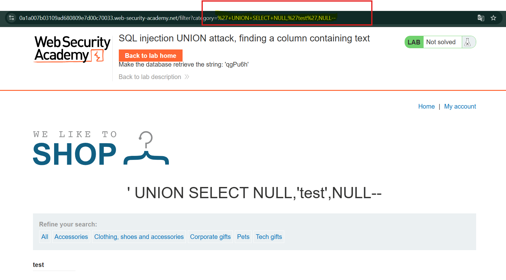
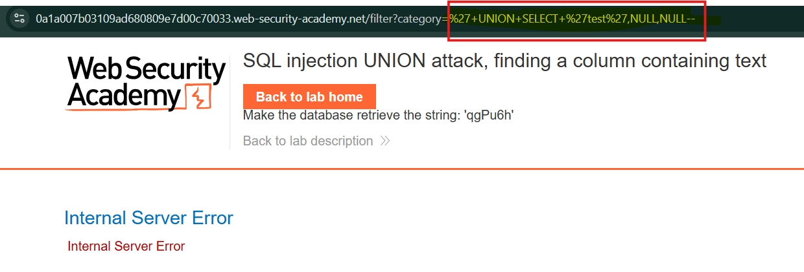

# Лабораторная работа: SQL-инъекция, UNION-атака, поиск столбца, содержащего текст.

## Overview

В данной лабораторной работе рассматривается уязвимость **SQL Injection** в фильтре категорий товаров.

Как и в предыдущей лабораторной работе, результаты SQL-запроса возвращаются в ответе приложения, что позволяет использовать **UNION-based SQL Injection** для получения данных из других таблиц базы данных.

На предыдущем этапе мы определили количество столбцов, возвращаемых исходным запросом. Следующим шагом UNION-атаки является определение, какие из этих столбцов совместимы со строковыми данными.

---

## Lab Objective

Цель лабораторной работы — определить столбец, который может содержать текстовые значения.

Для этого необходимо выполнить UNION SQL Injection, которая:

- возвращает дополнительную строку;
- содержит заданное текстовое значение;
- позволяет определить столбец, отображающий строковые данные.

---

## Theory

При выполнении UNION-атаки количество столбцов должно совпадать с оригинальным запросом.

Однако не каждый столбец может содержать текстовые значения.

Например, если запрос возвращает 3 столбца:

```sql
SELECT column1, column2, column3 FROM products
```

Необходимо проверить, какой из них поддерживает текст:

```sql
UNION SELECT 'test',NULL,NULL--

UNION SELECT NULL,'test',NULL--

UNION SELECT NULL,NULL,'test'--
```

Если значение test появляется в ответе приложения, значит данный столбец совместим со строковым типом данных.

```sql
' +UNION+SELECT+NULL,'test',NULL--
```



Пример запроса при котором у нас нет ответа:

```sql
' +UNION+SELECT+'test',NULL,NULL--
```


