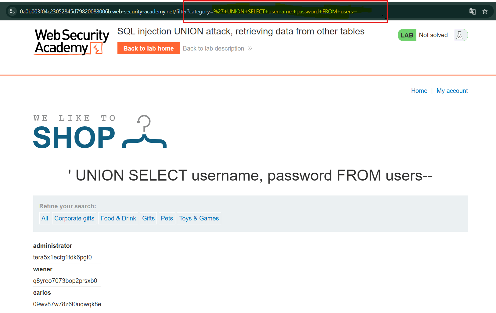

# Lab: UNION SQL Injection - Retrieving Data from Other Tables

## Overview

В данной лабораторной работе рассматривается уязвимость **SQL Injection** в фильтре категорий товаров.

Результаты SQL-запроса возвращаются в ответе приложения, поэтому возможно использование **UNION-based SQL Injection** для извлечения данных из других таблиц базы данных.

В предыдущих лабораторных работах мы попрактиковались с основными этапами UNION-атак:

- определение количества столбцов;
- поиск столбцов, совместимых со строковыми данными.

В этой лабораторной работе необходимо объединить полученные знания для извлечения данных из другой таблицы базы данных.

---

## Lab Objective

Цель лабораторной работы — получить данные пользователей из таблицы `users` и использовать их для входа в систему.

В базе данных существует таблица:

```sql
users
```

с двумя столбцами:
```sql
username
password
```

Необходимо выполнить UNION SQL Injection, которая позволит получить:

имена пользователей;
пароли пользователей.

После получения данных необходимо использовать учетные данные пользователя administrator для авторизации в приложении.

В лабораторной работе запрос будет выглядеть так:

```sql
'+UNION+SELECT+username,+password+FROM+users--
```

Разбор запроса:
```sql
' — закрытие исходного запроса  
UNION SELECT — добавление нового запроса  
username,password — извлекаемые поля  
users — целевая таблица  
-- — комментарий для отключения остальной части запроса
```



Дальше пытаемся авторизоваться с полученными учётными данными:

```sql
administrator
tera5x1ecfg1fdk6pgf0
```


