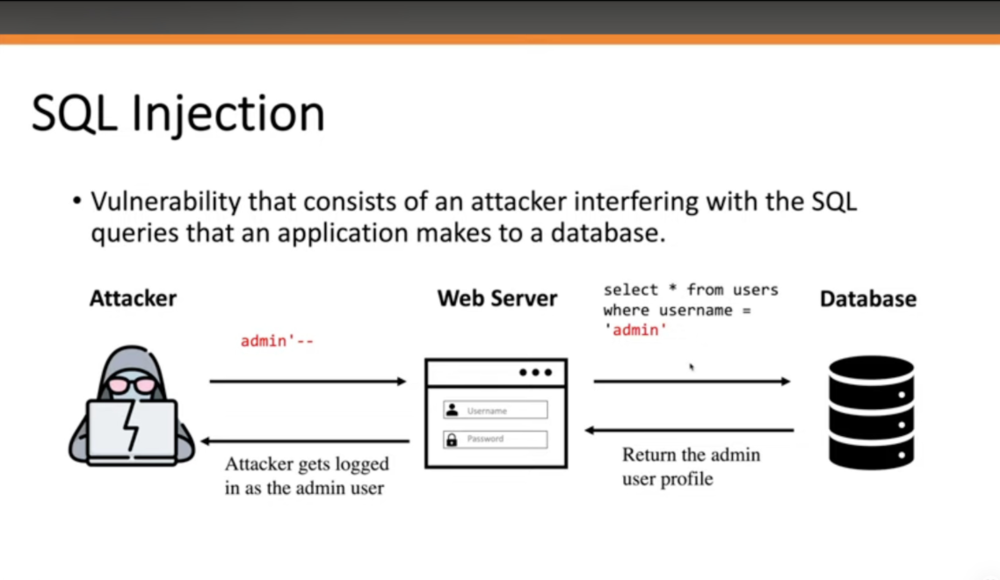
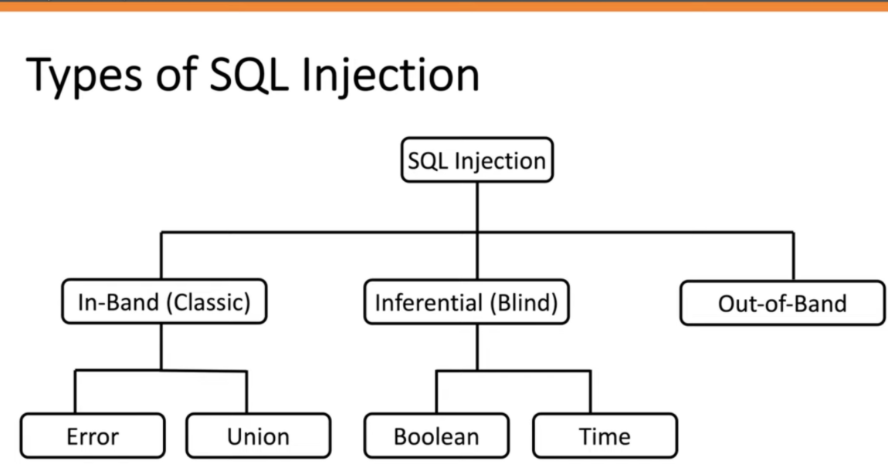

# SQL Injection

# Что это?

SQL-инъекция (SQLi) — это уязвимость веб-безопасности, позволяющая злоумышленнику вмешиваться в запросы, которые приложение отправляет к своей базе данных. Это может позволить злоумышленнику получить доступ к данным, которые он обычно не может получить. Это могут быть данные, принадлежащие другим пользователям, или любые другие данные, к которым приложение имеет доступ.




Перед изучением практических атак важно понять фундаментальные принципы SQL-инъекций: как формируются SQL-запросы, где возникают уязвимые точки и каким образом некорректная обработка пользовательского ввода приводит к компрометации данных.

# Карта угроз: Типы SQL Injection

Прежде чем начинать погружаться в глубину написания эксплойтов, рассмотрим «карту местности». SQL-инъекции не монолитны — они делятся на типы в зависимости от того, как атакующий получает ответ от сервера.

Схема, предоставленная ниже — это наш навигатор. Она четко разделяет атаки на три ветви:

In-Band — это «быстро и громко»: вы видите ошибки или данные сразу на экране.

Blind (Inferential) — это «тихо и долго»: вы не видите данных, но по поведению сайта (истина/ложь или задержка) понимаете, что происходит внутри.

Out-of-Band — это когда стандартные пути закрыты, и данные «утекают» в обход, например, через DNS-логи.

Эта классификация критически важна: она определяет не только сложность атаки, но и стратегию вашей защиты.



## Как обнаружить уязвимости SQL-инъекций

SQL-инъекции можно обнаружить, проверяя различные точки ввода данных в приложении и анализируя реакцию системы на специальные SQL-выражения.

Основные методы обнаружения:

- **Одинарная кавычка (`'`)** — помогает выявить ошибки SQL или необычное поведение приложения.
- **Логические проверки (`OR 1=1`, `OR 1=2`)** — позволяют определить, влияет ли пользовательский ввод на SQL-запрос.
- **Сравнение ответов приложения** — разные SQL-условия могут вызывать различия в содержимом или поведении страницы.
- **Time-based проверки** — создание задержек выполнения запроса помогает обнаружить слепые SQL-инъекции.
- **OAST (Out-of-Band)** — использование внешних взаимодействий (например, DNS/HTTP) для обнаружения уязвимостей без прямого отображения результата.

Также для автоматического поиска SQL-инъекций можно использовать Burp Suite Scanner.

## SQL-инъекция в различных частях запроса

SQL-инъекции могут возникать не только в стандартном `WHERE`-условии запроса `SELECT`. Любая часть SQL-запроса, которая использует пользовательский ввод без правильной обработки, может стать точкой атаки.

Основные места возникновения SQL Injection:

- **SELECT + WHERE** — самый распространённый вариант, когда пользовательский ввод влияет на условия поиска.
- **UPDATE** — уязвимость может находиться как в изменяемых значениях, так и в условии `WHERE`.
- **INSERT** — атака возможна через данные, которые добавляются в базу.
- **SELECT (имена таблиц и столбцов)** — пользовательский ввод может влиять на структуру запроса.
- **ORDER BY** — уязвимость может возникнуть при управлении сортировкой результатов.

Важно помнить: SQL Injection зависит не от конкретного типа запроса, а от того, как приложение обрабатывает пользовательские данные.

## Примеры SQL-инъекций

SQL Injection может использоваться разными способами в зависимости от цели атаки и поведения приложения. Основные типы атак:

- **Извлечение скрытых данных** — изменение SQL-запроса для получения информации, которая изначально не должна отображаться пользователю.
- **Обход логики приложения** — изменение условий запроса для обхода ограничений или изменения поведения приложения.
- **UNION-атаки** — использование оператора `UNION` для объединения результатов нескольких запросов и извлечения данных из других таблиц базы данных.
- **Blind SQL Injection** — ситуация, когда приложение не возвращает данные напрямую, но информацию можно получить через анализ поведения приложения (например, по разнице ответов или времени выполнения).

Каждый тип SQL Injection требует своего подхода к обнаружению и эксплуатации.


После изучения основных принципов SQL Injection перейдём к одному из наиболее распространённых методов эксплуатации — **UNION-based SQL Injection**.

Данный тип атаки позволяет использовать уязвимый SQL-запрос приложения для извлечения данных из других таблиц базы данных. Для успешной атаки необходимо понять структуру исходного запроса и подобрать корректный UNION-запрос.

# UNION-based SQL Injection

## Что такое UNION-атака

UNION-based SQL Injection — это метод эксплуатации SQL-инъекции, при котором используется оператор `UNION` для объединения результатов исходного SQL-запроса с результатами дополнительного запроса.

Если приложение возвращает результаты SQL-запроса в ответе пользователю, атакующий может использовать `UNION` для получения данных из других таблиц базы данных.

Пример:

```sql
SELECT a, b FROM table1 
UNION 
SELECT c, d FROM table2;
```

Более подробно описано на сайте Portswigger.net

## References

- [PortSwigger Web Security Academy — SQL-инъекции, UNION-атаки](https://portswigger.net/web-security/sql-injection/union-attacks?utm_source=chatgpt.com)
